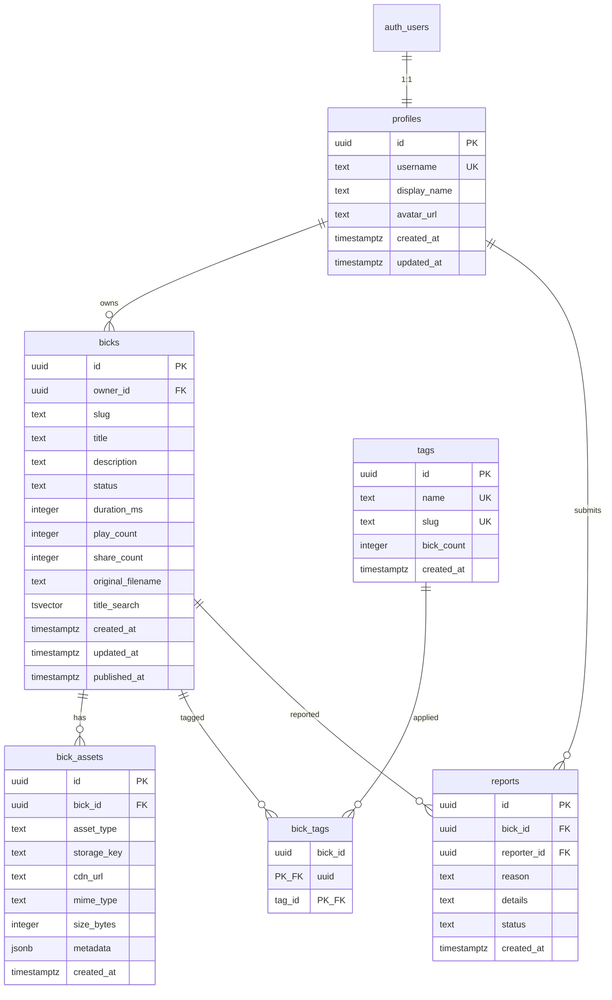

# Design Document: Data Model Supabase

## Overview

This design document describes the foundational data model and Supabase setup for Bickqr. The implementation creates a PostgreSQL database schema using Supabase, with tables for profiles, bicks, bick_assets, tags, bick_tags, and reports. The design emphasizes security through Row Level Security (RLS) policies, performance through strategic indexing, and maintainability through versioned SQL migrations.

The schema supports the core Bickqr functionality: storing and retrieving short audio clips with metadata, managing user profiles, categorizing content with tags, enabling full-text search, and handling content reports.

## Architecture



### File Structure

```
supabase/
├── migrations/
│   └── 0001_init.sql          # Initial schema migration
├── seed.sql                    # Optional test data
└── config.toml                 # Supabase CLI configuration
```

### Security Model

The RLS policies follow a layered security approach:

1. **Public Read Access**: Limited to live content only (bicks with status='live')
2. **Authenticated Write Access**: Users can only create/modify their own content
3. **Service Role Access**: Full access for backend operations (reports, admin)

## Components and Interfaces

### Migration System

The migration system uses Supabase CLI conventions:

```sql
-- Migration file naming: NNNN_description.sql
-- Example: 0001_init.sql

-- Each migration is idempotent where possible
-- Uses IF NOT EXISTS for table creation
-- Uses CREATE OR REPLACE for functions
```

### Database Functions

#### Timestamp Trigger Function

```sql
CREATE OR REPLACE FUNCTION update_updated_at()
RETURNS TRIGGER AS $$
BEGIN
    NEW.updated_at = NOW();
    RETURN NEW;
END;
$$ LANGUAGE plpgsql;
```

#### Published At Trigger Function

```sql
CREATE OR REPLACE FUNCTION set_published_at()
RETURNS TRIGGER AS $$
BEGIN
    IF NEW.status = 'live' AND OLD.status != 'live' THEN
        NEW.published_at = NOW();
    END IF;
    RETURN NEW;
END;
$$ LANGUAGE plpgsql;
```

### RLS Policy Definitions

#### Profiles Policies

```sql
-- Public read
CREATE POLICY "profiles_public_read" ON profiles
    FOR SELECT USING (true);

-- Owner update
CREATE POLICY "profiles_owner_update" ON profiles
    FOR UPDATE USING (auth.uid() = id);
```

#### Bicks Policies

```sql
-- Public read (live only)
CREATE POLICY "bicks_public_read" ON bicks
    FOR SELECT USING (status = 'live');

-- Authenticated insert (own bicks)
CREATE POLICY "bicks_auth_insert" ON bicks
    FOR INSERT WITH CHECK (auth.uid() = owner_id);

-- Owner update
CREATE POLICY "bicks_owner_update" ON bicks
    FOR UPDATE USING (auth.uid() = owner_id);
```

#### Bick Assets Policies

```sql
-- Public read (live bicks only)
CREATE POLICY "bick_assets_public_read" ON bick_assets
    FOR SELECT USING (
        EXISTS (
            SELECT 1 FROM bicks 
            WHERE bicks.id = bick_assets.bick_id 
            AND bicks.status = 'live'
        )
    );
```

#### Tags Policies

```sql
-- Public read
CREATE POLICY "tags_public_read" ON tags
    FOR SELECT USING (true);
```

#### Bick Tags Policies

```sql
-- Public read (live bicks only)
CREATE POLICY "bick_tags_public_read" ON bick_tags
    FOR SELECT USING (
        EXISTS (
            SELECT 1 FROM bicks 
            WHERE bicks.id = bick_tags.bick_id 
            AND bicks.status = 'live'
        )
    );
```

#### Reports Policies

```sql
-- Anyone can insert
CREATE POLICY "reports_insert" ON reports
    FOR INSERT WITH CHECK (true);

-- No public read (service role only)
-- No SELECT policy = no public access
```

### Full-Text Search Configuration

```sql
-- Add tsvector column
ALTER TABLE bicks ADD COLUMN title_search tsvector
    GENERATED ALWAYS AS (to_tsvector('english', coalesce(title, ''))) STORED;

-- Create GIN index
CREATE INDEX bicks_title_search_idx ON bicks USING GIN (title_search);

-- Example search query
SELECT * FROM bicks 
WHERE title_search @@ plainto_tsquery('english', 'search term')
AND status = 'live'
ORDER BY ts_rank(title_search, plainto_tsquery('english', 'search term')) DESC;
```

## Data Models

### TypeScript Types

```typescript
// src/types/database.types.ts

export type BickStatus = 'processing' | 'live' | 'failed' | 'removed';
export type AssetType = 'original' | 'audio' | 'waveform_json' | 'og_image' | 'teaser_mp4' | 'thumbnail';
export type ReportStatus = 'pending' | 'reviewed' | 'dismissed';

export interface Profile {
  id: string;
  username: string;
  display_name: string | null;
  avatar_url: string | null;
  created_at: string;
  updated_at: string;
}

export interface Bick {
  id: string;
  owner_id: string;
  slug: string;
  title: string;
  description: string | null;
  status: BickStatus;
  duration_ms: number | null;
  play_count: number;
  share_count: number;
  original_filename: string | null;
  created_at: string;
  updated_at: string;
  published_at: string | null;
}

export interface BickAsset {
  id: string;
  bick_id: string;
  asset_type: AssetType;
  storage_key: string | null;
  cdn_url: string | null;
  mime_type: string | null;
  size_bytes: number | null;
  metadata: Record<string, unknown> | null;
  created_at: string;
}

export interface Tag {
  id: string;
  name: string;
  slug: string;
  bick_count: number;
  created_at: string;
}

export interface BickTag {
  bick_id: string;
  tag_id: string;
}

export interface Report {
  id: string;
  bick_id: string;
  reporter_id: string | null;
  reason: string;
  details: string | null;
  status: ReportStatus;
  created_at: string;
}
```

### Database Constraints

| Table | Constraint | Type | Description |
|-------|-----------|------|-------------|
| profiles | profiles_pkey | PRIMARY KEY | id |
| profiles | profiles_username_key | UNIQUE | username |
| profiles | profiles_id_fkey | FOREIGN KEY | id → auth.users(id) |
| bicks | bicks_pkey | PRIMARY KEY | id |
| bicks | bicks_slug_unique | UNIQUE | (id, slug) |
| bicks | bicks_status_check | CHECK | status IN ('processing', 'live', 'failed', 'removed') |
| bicks | bicks_owner_id_fkey | FOREIGN KEY | owner_id → profiles(id) |
| bick_assets | bick_assets_pkey | PRIMARY KEY | id |
| bick_assets | bick_assets_type_check | CHECK | asset_type IN ('original', 'audio', 'waveform_json', 'og_image', 'teaser_mp4', 'thumbnail') |
| bick_assets | bick_assets_bick_id_fkey | FOREIGN KEY | bick_id → bicks(id) ON DELETE CASCADE |
| tags | tags_pkey | PRIMARY KEY | id |
| tags | tags_name_key | UNIQUE | name |
| tags | tags_slug_key | UNIQUE | slug |
| bick_tags | bick_tags_pkey | PRIMARY KEY | (bick_id, tag_id) |
| bick_tags | bick_tags_bick_id_fkey | FOREIGN KEY | bick_id → bicks(id) ON DELETE CASCADE |
| bick_tags | bick_tags_tag_id_fkey | FOREIGN KEY | tag_id → tags(id) ON DELETE CASCADE |
| reports | reports_pkey | PRIMARY KEY | id |
| reports | reports_status_check | CHECK | status IN ('pending', 'reviewed', 'dismissed') |
| reports | reports_bick_id_fkey | FOREIGN KEY | bick_id → bicks(id) ON DELETE CASCADE |
| reports | reports_reporter_id_fkey | FOREIGN KEY | reporter_id → profiles(id) ON DELETE SET NULL |

### Index Strategy

| Table | Index Name | Columns | Type | Purpose |
|-------|-----------|---------|------|---------|
| profiles | profiles_pkey | id | B-tree | Primary key lookup |
| bicks | bicks_pkey | id | B-tree | Primary key lookup |
| bicks | bicks_slug_idx | slug | B-tree | URL slug lookup |
| bicks | bicks_owner_id_idx | owner_id | B-tree | Owner's bicks query |
| bicks | bicks_status_idx | status | B-tree | Status filtering |
| bicks | bicks_created_at_idx | created_at | B-tree | Chronological sorting |
| bicks | bicks_published_at_idx | published_at | B-tree | Published date sorting |
| bicks | bicks_title_search_idx | title_search | GIN | Full-text search |
| bick_assets | bick_assets_bick_id_idx | bick_id | B-tree | Asset lookup by bick |
| bick_assets | bick_assets_type_idx | asset_type | B-tree | Asset type filtering |
| tags | tags_name_idx | name | B-tree | Tag name lookup |
| tags | tags_slug_idx | slug | B-tree | Tag slug lookup |
| bick_tags | bick_tags_bick_id_idx | bick_id | B-tree | Tags for a bick |
| bick_tags | bick_tags_tag_id_idx | tag_id | B-tree | Bicks for a tag |
| reports | reports_bick_id_idx | bick_id | B-tree | Reports for a bick |
| reports | reports_status_idx | status | B-tree | Report status filtering |


## Correctness Properties

*A property is a characteristic or behavior that should hold true across all valid executions of a system—essentially, a formal statement about what the system should do. Properties serve as the bridge between human-readable specifications and machine-verifiable correctness guarantees.*

Based on the prework analysis, the following properties have been identified for property-based testing:

### Property 1: Profile Public Read Access

*For any* profile in the database, a public (unauthenticated) user query SHALL return that profile's data.

**Validates: Requirements 2.2**

### Property 2: Profile Owner-Only Update

*For any* profile and any user attempting an update, the update SHALL succeed if and only if the user's auth.uid() equals the profile's id.

**Validates: Requirements 2.3**

### Property 3: Bick Slug Uniqueness

*For any* two bicks with the same (id, slug) combination, the database SHALL reject the second insertion with a unique constraint violation.

**Validates: Requirements 3.2**

### Property 4: Live Status Visibility

*For any* bick, bick_asset, or bick_tag record, a public query SHALL return the record if and only if the associated bick has status = 'live'.

**Validates: Requirements 3.5, 4.3, 6.3**

### Property 5: Authenticated Bick Insert Ownership

*For any* authenticated user attempting to insert a bick, the insertion SHALL succeed if and only if the owner_id field matches the user's auth.uid().

**Validates: Requirements 3.6**

### Property 6: Bick Owner Update Restriction

*For any* bick and any authenticated user, an update attempt SHALL succeed if and only if the user's auth.uid() equals the bick's owner_id.

**Validates: Requirements 3.7**

### Property 7: Tags Public Read Access

*For any* tag in the database, a public (unauthenticated) user query SHALL return that tag's data.

**Validates: Requirements 5.3**

### Property 8: Reports Insert Allowed

*For any* user (authenticated or anonymous), inserting a report with valid bick_id and reason SHALL succeed.

**Validates: Requirements 7.3**

### Property 9: Reports Read Blocked

*For any* report in the database, a public (non-service-role) query SHALL return zero results.

**Validates: Requirements 7.4**

### Property 10: Full-Text Search Relevance

*For any* search query term that appears in a live bick's title, the full-text search SHALL return that bick in the results.

**Validates: Requirements 8.3**

### Property 11: Automatic Timestamp Management

*For any* row insertion, created_at SHALL be automatically set to the current timestamp. *For any* row update on profiles or bicks, updated_at SHALL be automatically updated. *For any* bick status change from non-live to 'live', published_at SHALL be set to the current timestamp.

**Validates: Requirements 9.1, 9.2, 9.3**

## Error Handling

### Database Constraint Violations

| Error Type | Cause | Response |
|------------|-------|----------|
| Unique violation (23505) | Duplicate username, slug, or tag name | Return 409 Conflict with field name |
| Foreign key violation (23503) | Invalid owner_id, bick_id, or tag_id | Return 400 Bad Request with reference error |
| Check constraint violation (23514) | Invalid status or asset_type value | Return 400 Bad Request with allowed values |
| Not null violation (23502) | Missing required field | Return 400 Bad Request with field name |

### RLS Policy Violations

| Scenario | Behavior |
|----------|----------|
| Public read of non-live bick | Returns empty result (not error) |
| Unauthorized update attempt | Returns empty result (not error) |
| Insert with mismatched owner_id | Returns RLS violation error |

### Migration Errors

| Error Type | Resolution |
|------------|------------|
| Syntax error in migration | Fix SQL and re-run migration |
| Duplicate migration number | Rename migration file |
| Failed migration | Roll back and fix, then re-apply |

### Supabase Client Error Handling

```typescript
// src/lib/supabase/errors.ts
export function handleSupabaseError(error: PostgrestError): AppError {
  switch (error.code) {
    case '23505':
      return { type: 'CONFLICT', message: 'Resource already exists', field: extractField(error) };
    case '23503':
      return { type: 'BAD_REQUEST', message: 'Referenced resource not found' };
    case '23514':
      return { type: 'BAD_REQUEST', message: 'Invalid value for field' };
    case '23502':
      return { type: 'BAD_REQUEST', message: 'Required field missing' };
    case '42501':
      return { type: 'FORBIDDEN', message: 'Permission denied' };
    default:
      return { type: 'INTERNAL', message: 'Database error' };
  }
}
```

## Testing Strategy

### Dual Testing Approach

This feature requires both unit tests and property-based tests:

- **Unit tests**: Verify specific schema structures, constraint behaviors, and edge cases
- **Property tests**: Verify RLS policies and timestamp behaviors across all valid inputs

### Property-Based Testing Configuration

- **Library**: [fast-check](https://github.com/dubzzz/fast-check) for TypeScript
- **Minimum iterations**: 100 per property test
- **Tag format**: `Feature: data-model-supabase, Property N: {property_text}`

### Test Categories

#### Schema Validation Tests (Unit)

```typescript
// Verify table structures match spec
describe('Schema Validation', () => {
  it('profiles table has correct columns');
  it('bicks table has correct columns and constraints');
  it('bick_assets table has correct columns');
  it('tags table has correct columns');
  it('bick_tags table has correct primary key');
  it('reports table has correct columns');
  it('all required indexes exist');
});
```

#### RLS Policy Tests (Property-Based)

```typescript
// Feature: data-model-supabase, Property 4: Live Status Visibility
fc.assert(
  fc.property(
    fc.record({ status: fc.constantFrom('processing', 'live', 'failed', 'removed') }),
    async (bick) => {
      // Insert bick with given status
      // Query as public user
      // Assert: result.length > 0 iff status === 'live'
    }
  ),
  { numRuns: 100 }
);
```

#### Timestamp Tests (Property-Based)

```typescript
// Feature: data-model-supabase, Property 11: Automatic Timestamp Management
fc.assert(
  fc.property(
    fc.record({ title: fc.string({ minLength: 1 }) }),
    async (bickData) => {
      // Insert bick
      // Assert: created_at is set and recent
      // Update bick
      // Assert: updated_at changed
    }
  ),
  { numRuns: 100 }
);
```

#### Constraint Tests (Unit)

```typescript
describe('Constraint Validation', () => {
  it('rejects duplicate usernames');
  it('rejects duplicate tag names');
  it('rejects invalid bick status values');
  it('rejects invalid asset_type values');
  it('enforces foreign key relationships');
});
```

### Test Database Setup

Tests should run against a local Supabase instance or a dedicated test project:

```typescript
// tests/setup.ts
import { createClient } from '@supabase/supabase-js';

export const supabaseAdmin = createClient(
  process.env.SUPABASE_URL!,
  process.env.SUPABASE_SERVICE_ROLE_KEY!
);

export const supabaseAnon = createClient(
  process.env.SUPABASE_URL!,
  process.env.SUPABASE_ANON_KEY!
);

beforeEach(async () => {
  // Clean test data
  await supabaseAdmin.from('bick_tags').delete().neq('bick_id', '');
  await supabaseAdmin.from('bick_assets').delete().neq('id', '');
  await supabaseAdmin.from('reports').delete().neq('id', '');
  await supabaseAdmin.from('bicks').delete().neq('id', '');
  await supabaseAdmin.from('tags').delete().neq('id', '');
  await supabaseAdmin.from('profiles').delete().neq('id', '');
});
```

### Demo Verification Checklist

1. Run `supabase db push` or apply migration
2. Insert a test profile using service role
3. Insert a bick with status 'processing'
4. Verify public cannot read processing bick (anon client returns empty)
5. Update bick status to 'live'
6. Verify public can now read the bick
7. Insert a report and verify it's not publicly readable
8. Run a full-text search query on title
