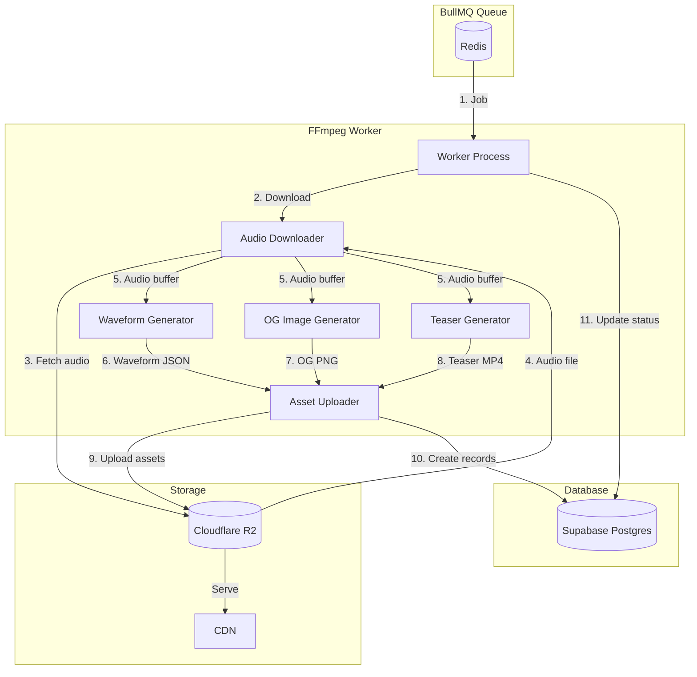

# Design Document: FFmpeg Worker

## Overview

This design document describes the FFmpeg Worker for Bickqr, a background processing service that generates rich media assets from uploaded audio files. The worker processes jobs from a BullMQ queue, downloads audio from R2, and uses FFmpeg to generate three types of assets:

1. **Waveform JSON**: Amplitude data for client-side waveform visualization
2. **OG Image**: 1200x630px PNG with waveform overlay on brand background
3. **Teaser MP4**: 3-5 second video with animated waveform synced to audio

The worker is designed to run as a standalone Node.js process on Railway (or similar) with FFmpeg installed. It uses the existing R2 client for storage and Supabase for database operations.

## Architecture



### File Structure

```
worker/
├── index.ts                    # Worker entry point (enhanced)
├── lib/
│   ├── downloader.ts           # R2 audio download utilities
│   ├── ffmpeg.ts               # FFmpeg command execution
│   ├── waveform.ts             # Waveform JSON generation
│   ├── og-image.ts             # OG image generation
│   ├── teaser.ts               # Teaser MP4 generation
│   └── uploader.ts             # R2 upload utilities
└── types.ts                    # Worker-specific types

src/lib/r2/
└── client.ts                   # Enhanced with download/upload methods
```

## Components and Interfaces

### Worker Entry Point

```typescript
// worker/index.ts

import { Worker, Job } from 'bullmq';
import { createClient } from '@supabase/supabase-js';
import type { Database } from '../src/types/database.types';
import type { BickProcessingJob } from '../src/lib/queue/jobs';
import { processBick } from './processors/bick-processor';

const REDIS_URL = process.env.REDIS_URL!;
const SUPABASE_URL = process.env.NEXT_PUBLIC_SUPABASE_URL!;
const SUPABASE_SERVICE_KEY = process.env.SUPABASE_SERVICE_ROLE_KEY!;
const WORKER_CONCURRENCY = parseInt(process.env.WORKER_CONCURRENCY || '5', 10);

const supabase = createClient<Database>(SUPABASE_URL, SUPABASE_SERVICE_KEY);

const worker = new Worker<BickProcessingJob>(
  'bick-processing',
  async (job) => {
    console.log(`[Worker] Processing job ${job.id}: bick ${job.data.bickId}`);
    await processBick(job.data, supabase);
  },
  {
    connection: { url: REDIS_URL },
    concurrency: WORKER_CONCURRENCY,
    removeOnComplete: { count: 100 },
    removeOnFail: { count: 1000 },
  }
);

// Graceful shutdown
process.on('SIGTERM', async () => {
  console.log('[Worker] Shutting down...');
  await worker.close();
  process.exit(0);
});
```

### Bick Processor

```typescript
// worker/processors/bick-processor.ts

import { SupabaseClient } from '@supabase/supabase-js';
import type { Database } from '../../src/types/database.types';
import type { BickProcessingJob } from '../../src/lib/queue/jobs';
import { downloadAudio, cleanupTempFiles } from '../lib/downloader';
import { generateWaveformJson } from '../lib/waveform';
import { generateOgImage } from '../lib/og-image';
import { generateTeaser } from '../lib/teaser';
import { uploadAsset } from '../lib/uploader';

interface ProcessingResult {
  waveformUrl: string;
  ogImageUrl: string;
  teaserUrl: string;
}

export async function processBick(
  job: BickProcessingJob,
  supabase: SupabaseClient<Database>
): Promise<ProcessingResult> {
  const { bickId, storageKey } = job;
  const tempDir = `/tmp/bick-${bickId}`;
  
  try {
    // 1. Download audio from R2
    console.log(`[Processor] Downloading audio for bick ${bickId}`);
    const audioPath = await downloadAudio(storageKey, tempDir);
    
    // 2. Generate waveform JSON
    console.log(`[Processor] Generating waveform for bick ${bickId}`);
    const waveformPath = await generateWaveformJson(audioPath, tempDir);
    const waveformKey = `uploads/${bickId}/waveform.json`;
    const waveformUrl = await uploadAsset(waveformPath, waveformKey, 'application/json');
    await createAssetRecord(supabase, bickId, 'waveform_json', waveformKey, waveformUrl, waveformPath);
    
    // 3. Generate OG image
    console.log(`[Processor] Generating OG image for bick ${bickId}`);
    const ogPath = await generateOgImage(audioPath, tempDir);
    const ogKey = `uploads/${bickId}/og.png`;
    const ogUrl = await uploadAsset(ogPath, ogKey, 'image/png');
    await createAssetRecord(supabase, bickId, 'og_image', ogKey, ogUrl, ogPath);
    
    // 4. Generate teaser MP4
    console.log(`[Processor] Generating teaser for bick ${bickId}`);
    const teaserPath = await generateTeaser(audioPath, tempDir);
    const teaserKey = `uploads/${bickId}/teaser.mp4`;
    const teaserUrl = await uploadAsset(teaserPath, teaserKey, 'video/mp4');
    await createAssetRecord(supabase, bickId, 'teaser_mp4', teaserKey, teaserUrl, teaserPath);
    
    // 5. Mark bick as live
    console.log(`[Processor] Marking bick ${bickId} as live`);
    await supabase
      .from('bicks')
      .update({ 
        status: 'live',
        published_at: new Date().toISOString(),
      })
      .eq('id', bickId);
    
    return { waveformUrl, ogImageUrl: ogUrl, teaserUrl };
    
  } catch (error) {
    console.error(`[Processor] Failed to process bick ${bickId}:`, error);
    
    // Mark bick as failed
    await supabase
      .from('bicks')
      .update({ status: 'failed' })
      .eq('id', bickId);
    
    throw error;
  } finally {
    // Cleanup temp files
    await cleanupTempFiles(tempDir);
  }
}

async function createAssetRecord(
  supabase: SupabaseClient<Database>,
  bickId: string,
  assetType: 'waveform_json' | 'og_image' | 'teaser_mp4',
  storageKey: string,
  cdnUrl: string,
  filePath: string
): Promise<void> {
  const fs = await import('fs/promises');
  const stats = await fs.stat(filePath);
  
  const mimeTypes = {
    waveform_json: 'application/json',
    og_image: 'image/png',
    teaser_mp4: 'video/mp4',
  };
  
  await supabase.from('bick_assets').insert({
    bick_id: bickId,
    asset_type: assetType,
    storage_key: storageKey,
    cdn_url: cdnUrl,
    mime_type: mimeTypes[assetType],
    size_bytes: stats.size,
  });
}
```

### Audio Downloader

```typescript
// worker/lib/downloader.ts

import { S3Client, GetObjectCommand } from '@aws-sdk/client-s3';
import { createWriteStream } from 'fs';
import { mkdir, rm } from 'fs/promises';
import { Readable } from 'stream';
import { pipeline } from 'stream/promises';
import path from 'path';

const r2Client = new S3Client({
  region: 'auto',
  endpoint: `https://${process.env.R2_ACCOUNT_ID}.r2.cloudflarestorage.com`,
  credentials: {
    accessKeyId: process.env.R2_ACCESS_KEY_ID!,
    secretAccessKey: process.env.R2_SECRET_ACCESS_KEY!,
  },
});

/**
 * Downloads audio file from R2 to local temp directory.
 * Returns the path to the downloaded file.
 */
export async function downloadAudio(
  storageKey: string,
  tempDir: string
): Promise<string> {
  await mkdir(tempDir, { recursive: true });
  
  const ext = path.extname(storageKey) || '.mp3';
  const localPath = path.join(tempDir, `original${ext}`);
  
  const command = new GetObjectCommand({
    Bucket: process.env.R2_BUCKET_NAME!,
    Key: storageKey,
  });
  
  const response = await r2Client.send(command);
  
  if (!response.Body) {
    throw new Error(`Failed to download audio: empty response for ${storageKey}`);
  }
  
  const writeStream = createWriteStream(localPath);
  await pipeline(response.Body as Readable, writeStream);
  
  return localPath;
}

/**
 * Cleans up temporary files after processing.
 */
export async function cleanupTempFiles(tempDir: string): Promise<void> {
  try {
    await rm(tempDir, { recursive: true, force: true });
  } catch (error) {
    console.warn(`[Cleanup] Failed to remove temp dir ${tempDir}:`, error);
  }
}
```

### FFmpeg Utilities

```typescript
// worker/lib/ffmpeg.ts

import { exec } from 'child_process';
import { promisify } from 'util';

const execAsync = promisify(exec);

export interface FFmpegResult {
  stdout: string;
  stderr: string;
}

/**
 * Executes an FFmpeg command with timeout and error handling.
 */
export async function runFFmpeg(
  args: string[],
  timeoutMs: number = 120000
): Promise<FFmpegResult> {
  const command = `ffmpeg ${args.join(' ')}`;
  
  try {
    const { stdout, stderr } = await execAsync(command, {
      timeout: timeoutMs,
      maxBuffer: 50 * 1024 * 1024, // 50MB buffer for large outputs
    });
    return { stdout, stderr };
  } catch (error: unknown) {
    const execError = error as { stderr?: string; message?: string };
    const stderr = execError.stderr || execError.message || 'Unknown FFmpeg error';
    console.error(`[FFmpeg] Command failed: ${command}`);
    console.error(`[FFmpeg] stderr: ${stderr}`);
    throw new Error(`FFmpeg failed: ${stderr}`);
  }
}

/**
 * Gets audio duration in seconds using ffprobe.
 */
export async function getAudioDuration(audioPath: string): Promise<number> {
  const { stdout } = await execAsync(
    `ffprobe -v error -show_entries format=duration -of default=noprint_wrappers=1:nokey=1 "${audioPath}"`
  );
  return parseFloat(stdout.trim());
}

/**
 * Validates that a file is a valid audio file.
 */
export async function validateAudio(audioPath: string): Promise<boolean> {
  try {
    await execAsync(
      `ffprobe -v error -select_streams a:0 -show_entries stream=codec_type -of default=noprint_wrappers=1:nokey=1 "${audioPath}"`
    );
    return true;
  } catch {
    return false;
  }
}
```

### Waveform Generator

```typescript
// worker/lib/waveform.ts

import { runFFmpeg, getAudioDuration } from './ffmpeg';
import { writeFile } from 'fs/promises';
import path from 'path';

/**
 * Waveform data structure for client-side rendering.
 * Contains normalized amplitude values (0.0 to 1.0).
 */
export interface WaveformData {
  version: 1;
  sampleRate: number;
  samplesPerSecond: number;
  duration: number;
  peaks: number[];
}

/**
 * Generates waveform JSON data from an audio file.
 * 
 * Uses FFmpeg to extract PCM data, then processes it into
 * normalized peak values suitable for client-side rendering.
 * 
 * Target: ~100 samples per second of audio for smooth visualization.
 */
export async function generateWaveformJson(
  audioPath: string,
  outputDir: string
): Promise<string> {
  const duration = await getAudioDuration(audioPath);
  const samplesPerSecond = 100;
  const totalSamples = Math.ceil(duration * samplesPerSecond);
  
  // Calculate the sample rate needed to get ~100 samples per second
  // We'll downsample to this rate, then take absolute peaks
  const targetSampleRate = samplesPerSecond;
  
  const pcmPath = path.join(outputDir, 'waveform.pcm');
  
  // Extract audio as raw PCM (mono, 16-bit signed, downsampled)
  await runFFmpeg([
    '-i', `"${audioPath}"`,
    '-ac', '1',                          // Mono
    '-ar', String(targetSampleRate),     // Downsample
    '-f', 's16le',                        // 16-bit signed little-endian
    '-acodec', 'pcm_s16le',
    '-y',
    `"${pcmPath}"`,
  ]);
  
  // Read PCM data and convert to normalized peaks
  const fs = await import('fs/promises');
  const pcmBuffer = await fs.readFile(pcmPath);
  const peaks = extractPeaks(pcmBuffer, totalSamples);
  
  const waveformData: WaveformData = {
    version: 1,
    sampleRate: targetSampleRate,
    samplesPerSecond,
    duration,
    peaks,
  };
  
  const outputPath = path.join(outputDir, 'waveform.json');
  await writeFile(outputPath, JSON.stringify(waveformData));
  
  // Cleanup PCM file
  await fs.unlink(pcmPath).catch(() => {});
  
  return outputPath;
}

/**
 * Extracts normalized peak values from PCM buffer.
 * PCM format: 16-bit signed little-endian mono.
 */
function extractPeaks(pcmBuffer: Buffer, targetSamples: number): number[] {
  const samples = pcmBuffer.length / 2; // 2 bytes per sample
  const samplesPerPeak = Math.max(1, Math.floor(samples / targetSamples));
  const peaks: number[] = [];
  
  for (let i = 0; i < samples; i += samplesPerPeak) {
    let maxAbs = 0;
    const end = Math.min(i + samplesPerPeak, samples);
    
    for (let j = i; j < end; j++) {
      const sample = pcmBuffer.readInt16LE(j * 2);
      const abs = Math.abs(sample);
      if (abs > maxAbs) maxAbs = abs;
    }
    
    // Normalize to 0.0 - 1.0
    peaks.push(maxAbs / 32768);
  }
  
  return peaks;
}
```

### OG Image Generator

```typescript
// worker/lib/og-image.ts

import { runFFmpeg, getAudioDuration } from './ffmpeg';
import path from 'path';

const OG_WIDTH = 1200;
const OG_HEIGHT = 630;
const BRAND_BACKGROUND = process.env.BRAND_BACKGROUND_PATH || 'public/brand-thumb.jpg';

/**
 * Generates an OG image (1200x630) with waveform overlay.
 * 
 * Uses FFmpeg's showwavespic filter to generate a waveform image,
 * then overlays it on the brand background.
 */
export async function generateOgImage(
  audioPath: string,
  outputDir: string
): Promise<string> {
  const outputPath = path.join(outputDir, 'og.png');
  
  // Waveform dimensions (centered with padding)
  const waveWidth = OG_WIDTH - 100;  // 50px padding each side
  const waveHeight = 200;
  const waveY = (OG_HEIGHT - waveHeight) / 2;
  
  // Generate OG image with waveform overlay on brand background
  // 1. Scale background to OG dimensions
  // 2. Generate waveform image from audio
  // 3. Overlay waveform on background (centered)
  await runFFmpeg([
    '-i', `"${BRAND_BACKGROUND}"`,
    '-i', `"${audioPath}"`,
    '-filter_complex', `"` +
      // Scale background to OG size
      `[0:v]scale=${OG_WIDTH}:${OG_HEIGHT}:force_original_aspect_ratio=increase,` +
      `crop=${OG_WIDTH}:${OG_HEIGHT}[bg];` +
      // Generate waveform with transparent background
      `[1:a]showwavespic=s=${waveWidth}x${waveHeight}:colors=white@0.8:filter=peak[wave];` +
      // Overlay waveform on background
      `[bg][wave]overlay=50:${waveY}:format=auto` +
    `"`,
    '-frames:v', '1',
    '-y',
    `"${outputPath}"`,
  ]);
  
  return outputPath;
}
```

### Teaser Video Generator

```typescript
// worker/lib/teaser.ts

import { runFFmpeg, getAudioDuration } from './ffmpeg';
import path from 'path';

const TEASER_WIDTH = 1280;
const TEASER_HEIGHT = 720;
const TEASER_DURATION = parseFloat(process.env.TEASER_DURATION || '5');
const BRAND_BACKGROUND = process.env.BRAND_BACKGROUND_PATH || 'public/brand-thumb.jpg';

/**
 * Generates a teaser MP4 video with animated waveform.
 * 
 * Uses FFmpeg's showwaves filter to create an animated waveform
 * visualization synced to the audio, overlaid on the brand background.
 * 
 * Output: H.264 video + AAC audio, 1280x720, 3-5 seconds
 */
export async function generateTeaser(
  audioPath: string,
  outputDir: string
): Promise<string> {
  const outputPath = path.join(outputDir, 'teaser.mp4');
  
  // Get actual audio duration to cap teaser length
  const audioDuration = await getAudioDuration(audioPath);
  const teaserDuration = Math.min(TEASER_DURATION, audioDuration);
  
  // Waveform dimensions (centered with padding)
  const waveWidth = TEASER_WIDTH - 100;
  const waveHeight = 200;
  const waveY = (TEASER_HEIGHT - waveHeight) / 2;
  
  // Generate teaser video with animated waveform
  // 1. Loop background image for video duration
  // 2. Generate animated waveform from audio
  // 3. Overlay waveform on background
  // 4. Encode with H.264/AAC
  await runFFmpeg([
    '-loop', '1',
    '-i', `"${BRAND_BACKGROUND}"`,
    '-i', `"${audioPath}"`,
    '-filter_complex', `"` +
      // Scale and loop background
      `[0:v]scale=${TEASER_WIDTH}:${TEASER_HEIGHT}:force_original_aspect_ratio=increase,` +
      `crop=${TEASER_WIDTH}:${TEASER_HEIGHT},fps=30[bg];` +
      // Generate animated waveform with semi-transparent white
      `[1:a]showwaves=s=${waveWidth}x${waveHeight}:mode=cline:colors=white@0.8:rate=30[wave];` +
      // Overlay waveform on background
      `[bg][wave]overlay=50:${waveY}:format=auto[v]` +
    `"`,
    '-map', '"[v]"',
    '-map', '1:a',
    '-c:v', 'libx264',
    '-preset', 'fast',
    '-crf', '23',
    '-c:a', 'aac',
    '-b:a', '128k',
    '-t', String(teaserDuration),
    '-shortest',
    '-y',
    `"${outputPath}"`,
  ], 180000); // 3 minute timeout for video encoding
  
  return outputPath;
}
```

### Asset Uploader

```typescript
// worker/lib/uploader.ts

import { S3Client, PutObjectCommand } from '@aws-sdk/client-s3';
import { readFile } from 'fs/promises';

const r2Client = new S3Client({
  region: 'auto',
  endpoint: `https://${process.env.R2_ACCOUNT_ID}.r2.cloudflarestorage.com`,
  credentials: {
    accessKeyId: process.env.R2_ACCESS_KEY_ID!,
    secretAccessKey: process.env.R2_SECRET_ACCESS_KEY!,
  },
});

const CDN_URL = process.env.NEXT_PUBLIC_CDN_URL!;

/**
 * Uploads a file to R2 and returns the CDN URL.
 */
export async function uploadAsset(
  filePath: string,
  storageKey: string,
  contentType: string
): Promise<string> {
  const fileBuffer = await readFile(filePath);
  
  const command = new PutObjectCommand({
    Bucket: process.env.R2_BUCKET_NAME!,
    Key: storageKey,
    Body: fileBuffer,
    ContentType: contentType,
  });
  
  await r2Client.send(command);
  
  // Return CDN URL
  const baseUrl = CDN_URL.endsWith('/') ? CDN_URL.slice(0, -1) : CDN_URL;
  return `${baseUrl}/${storageKey}`;
}
```

## Data Models

### Asset Types

The worker creates three types of assets, stored in the `bick_assets` table:

| Asset Type | MIME Type | Storage Key Pattern | Description |
|------------|-----------|---------------------|-------------|
| `waveform_json` | `application/json` | `uploads/{bickId}/waveform.json` | Amplitude data for visualization |
| `og_image` | `image/png` | `uploads/{bickId}/og.png` | 1200x630 social sharing image |
| `teaser_mp4` | `video/mp4` | `uploads/{bickId}/teaser.mp4` | 3-5 second video preview |

### Waveform JSON Schema

```typescript
interface WaveformData {
  version: 1;                    // Schema version for future compatibility
  sampleRate: number;            // Samples per second (typically 100)
  samplesPerSecond: number;      // Same as sampleRate
  duration: number;              // Audio duration in seconds
  peaks: number[];               // Normalized amplitudes (0.0 - 1.0)
}
```

### Environment Variables

```bash
# Required
REDIS_URL=redis://...
NEXT_PUBLIC_SUPABASE_URL=https://...
SUPABASE_SERVICE_ROLE_KEY=...
R2_ACCOUNT_ID=...
R2_ACCESS_KEY_ID=...
R2_SECRET_ACCESS_KEY=...
R2_BUCKET_NAME=...
NEXT_PUBLIC_CDN_URL=https://cdn.bickqr.com

# Optional
WORKER_CONCURRENCY=5           # Number of parallel jobs
TEASER_DURATION=5              # Teaser video duration in seconds
BRAND_BACKGROUND_PATH=public/brand-thumb.jpg
```


## Correctness Properties

*A property is a characteristic or behavior that should hold true across all valid executions of a system—essentially, a formal statement about what the system should do. Properties serve as the bridge between human-readable specifications and machine-verifiable correctness guarantees.*

Based on the prework analysis, the following properties have been identified for property-based testing:

### Property 1: Audio Validation

*For any* file path, the audio validation function SHALL return true if and only if the file is a valid audio format (MP3, WAV, OGG, M4A) that can be processed by FFmpeg.

**Validates: Requirements 1.2**

### Property 2: Waveform Resolution

*For any* valid audio file with duration D seconds, the generated waveform SHALL contain at least D × 100 samples (minimum 100 samples per second).

**Validates: Requirements 2.2**

### Property 3: Waveform Normalization

*For any* generated waveform JSON, all peak values in the peaks array SHALL be within the range [0.0, 1.0] inclusive.

**Validates: Requirements 2.3**

### Property 4: Storage Key Format

*For any* bickId and asset type, the generated storage key SHALL match the pattern `uploads/{bickId}/{assetName}` where assetName is one of: `waveform.json`, `og.png`, `teaser.mp4`.

**Validates: Requirements 2.4, 3.5, 4.5**

### Property 5: OG Image Dimensions

*For any* generated OG image, the dimensions SHALL be exactly 1200×630 pixels.

**Validates: Requirements 3.1**

### Property 6: OG Image Format

*For any* generated OG image file, the MIME type SHALL be `image/png`.

**Validates: Requirements 3.4**

### Property 7: Teaser Duration

*For any* generated teaser video from audio with duration D seconds, the teaser duration SHALL be min(D, TEASER_DURATION) seconds (within 0.5 second tolerance).

**Validates: Requirements 4.1**

### Property 8: Teaser Encoding

*For any* generated teaser video, the video codec SHALL be H.264, the audio codec SHALL be AAC, and the resolution SHALL be 1280×720.

**Validates: Requirements 4.4**

### Property 9: Asset Record Completeness

*For any* asset record created by the worker, the record SHALL have non-null values for: cdn_url, storage_key, mime_type, and size_bytes (where size_bytes > 0).

**Validates: Requirements 5.2, 5.3, 5.4, 5.5**

### Property 10: Failure Status Handling

*For any* processing job that encounters an error (download failure, invalid audio, FFmpeg failure), the bick status SHALL be updated to 'failed'.

**Validates: Requirements 1.3, 1.4, 6.3**

### Property 11: Success Status Invariant

*For any* bick with status 'live', there SHALL exist exactly three asset records with asset_types: 'waveform_json', 'og_image', and 'teaser_mp4'.

**Validates: Requirements 6.1, 6.4**

### Property 12: Published Timestamp

*For any* bick with status 'live', the published_at timestamp SHALL be non-null and set to a time after the bick's created_at timestamp.

**Validates: Requirements 6.2**

### Property 13: Temp File Cleanup

*For any* completed processing job (success or failure), the temporary directory `/tmp/bick-{bickId}` SHALL NOT exist after processing completes.

**Validates: Requirements 7.5**

## Error Handling

### Error Categories

| Error Type | Cause | Action | Retryable |
|------------|-------|--------|-----------|
| `DOWNLOAD_FAILED` | R2 network error, missing file | Mark failed, log error | Yes (3 attempts) |
| `INVALID_AUDIO` | Corrupted file, unsupported format | Mark failed, log error | No |
| `FFMPEG_FAILED` | FFmpeg command error | Mark failed, log stderr | Yes (3 attempts) |
| `UPLOAD_FAILED` | R2 upload error | Mark failed, log error | Yes (3 attempts) |
| `DATABASE_ERROR` | Supabase error | Mark failed, log error | Yes (3 attempts) |

### Retry Strategy

BullMQ handles retries with exponential backoff:
- Attempts: 3
- Initial delay: 1 second
- Backoff: Exponential (1s, 2s, 4s)

```typescript
// Queue configuration (already in place)
defaultJobOptions: {
  attempts: 3,
  backoff: {
    type: 'exponential',
    delay: 1000,
  },
}
```

### Error Logging Format

```typescript
console.error(`[Worker] Job ${jobId} failed at step ${step}:`, {
  bickId,
  step,
  error: error.message,
  stderr: ffmpegStderr, // For FFmpeg errors
});
```

## Testing Strategy

### Unit Tests

Unit tests verify individual components in isolation:

1. **Waveform extraction**: Test peak extraction from PCM buffers
2. **Storage key generation**: Test key format for various bickIds
3. **CDN URL construction**: Test URL building from storage keys
4. **Audio validation**: Test validation logic with mock ffprobe

### Property-Based Tests

Property tests verify universal properties across generated inputs:

1. **Waveform normalization**: Generate random PCM data, verify all peaks in [0, 1]
2. **Storage key format**: Generate random UUIDs, verify key pattern matches
3. **Asset record completeness**: Generate random assets, verify all fields populated

### Integration Tests

Integration tests verify the full processing pipeline:

1. **Happy path**: Upload audio → process → verify all assets created
2. **Invalid audio**: Upload non-audio file → verify status is 'failed'
3. **Partial failure**: Simulate FFmpeg failure → verify cleanup and status

### Test Configuration

```typescript
// vitest.config.ts additions for worker tests
export default defineConfig({
  test: {
    include: ['tests/**/*.test.ts', 'worker/**/*.test.ts'],
    testTimeout: 30000, // FFmpeg tests may take longer
  },
});
```

### Property Test Framework

Use `fast-check` for property-based testing (already in dependencies):

```typescript
import fc from 'fast-check';

// Example: Waveform normalization property
describe('Waveform Generator', () => {
  it('should produce normalized peaks', () => {
    fc.assert(
      fc.property(
        fc.array(fc.integer({ min: -32768, max: 32767 }), { minLength: 100 }),
        (samples) => {
          const buffer = Buffer.alloc(samples.length * 2);
          samples.forEach((s, i) => buffer.writeInt16LE(s, i * 2));
          const peaks = extractPeaks(buffer, samples.length);
          return peaks.every(p => p >= 0 && p <= 1);
        }
      ),
      { numRuns: 100 }
    );
  });
});
```

### Test Data

For integration tests, use short audio samples:
- `tests/fixtures/valid-audio.mp3`: 3-second valid MP3
- `tests/fixtures/invalid-audio.txt`: Text file with .mp3 extension
- `tests/fixtures/corrupted.mp3`: Truncated/corrupted MP3

