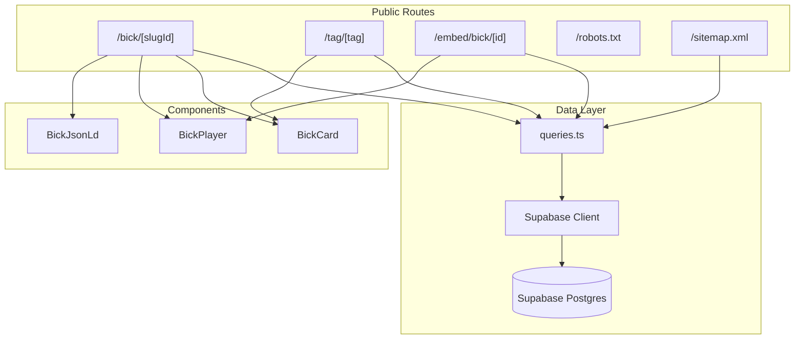

# Design Document: Public SEO Pages

## Overview

This design document describes the implementation of public SEO pages for Bickqr. The feature creates SSR pages with complete SEO metadata, Open Graph tags, Twitter Cards, and JSON-LD structured data. The implementation follows Next.js 14+ App Router conventions with server-side rendering to ensure all metadata is present in the initial HTML response.

The design covers:
- Individual bick pages with full metadata and structured data
- Tag landing pages with paginated bick listings
- Minimal embed player pages for iframe integration
- Dynamic robots.txt and sitemap.xml generation
- Reusable data fetching functions and UI components

## Architecture



### URL Structure

| Route | Pattern | Example |
|-------|---------|---------|
| Bick Page | `/bick/[slug]-[id]` | `/bick/funny-cat-sound-abc123` |
| Tag Page | `/tag/[tag]` | `/tag/funny` |
| Embed Page | `/embed/bick/[id]` | `/embed/bick/abc123` |
| Robots | `/robots.txt` | `/robots.txt` |
| Sitemap | `/sitemap.xml` | `/sitemap.xml` |

### File Structure

```
src/
├── app/
│   ├── bick/
│   │   └── [slugId]/
│   │       └── page.tsx          # Individual bick page
│   ├── tag/
│   │   └── [tag]/
│   │       └── page.tsx          # Tag landing page
│   ├── embed/
│   │   └── bick/
│   │       └── [id]/
│   │           └── page.tsx      # Minimal embed player
│   ├── robots.txt/
│   │   └── route.ts              # Dynamic robots.txt
│   └── sitemap.xml/
│       └── route.ts              # Dynamic sitemap
├── components/
│   └── bick/
│       ├── BickCard.tsx          # Bick summary card
│       ├── BickPlayer.tsx        # Audio player (placeholder)
│       └── BickJsonLd.tsx        # JSON-LD structured data
└── lib/
    └── supabase/
        └── queries.ts            # Data fetching functions
```

## Components and Interfaces

### Data Fetching Functions

```typescript
// src/lib/supabase/queries.ts

import { createClient } from './server';
import type { Bick, BickAsset, Tag, BickWithAssets } from '@/types/database.types';

/**
 * Fetch a single bick by slug and ID
 * Returns null if not found or not live
 */
export async function getBickBySlugAndId(
  slug: string,
  id: string
): Promise<BickWithAssets | null> {
  const supabase = await createClient();
  
  const { data: bick, error } = await supabase
    .from('bicks')
    .select(`
      *,
      assets:bick_assets(*)
    `)
    .eq('id', id)
    .eq('slug', slug)
    .eq('status', 'live')
    .single();

  if (error || !bick) return null;
  return bick as BickWithAssets;
}

/**
 * Fetch paginated bicks by tag slug
 * Uses cursor pagination for efficiency
 */
export async function getBicksByTag(
  tagSlug: string,
  cursor?: string,
  limit: number = 20
): Promise<{ bicks: Bick[]; nextCursor: string | null }> {
  const supabase = await createClient();
  
  // First get the tag
  const { data: tag } = await supabase
    .from('tags')
    .select('id')
    .eq('slug', tagSlug)
    .single();

  if (!tag) return { bicks: [], nextCursor: null };

  // Build query with cursor pagination
  let query = supabase
    .from('bicks')
    .select(`
      *,
      bick_tags!inner(tag_id)
    `)
    .eq('bick_tags.tag_id', tag.id)
    .eq('status', 'live')
    .order('published_at', { ascending: false })
    .limit(limit + 1);

  if (cursor) {
    query = query.lt('published_at', cursor);
  }

  const { data: bicks, error } = await query;

  if (error || !bicks) return { bicks: [], nextCursor: null };

  const hasMore = bicks.length > limit;
  const results = hasMore ? bicks.slice(0, limit) : bicks;
  const nextCursor = hasMore ? results[results.length - 1].published_at : null;

  return { bicks: results as Bick[], nextCursor };
}

/**
 * Fetch tag details by slug
 */
export async function getTagBySlug(slug: string): Promise<Tag | null> {
  const supabase = await createClient();
  
  const { data: tag, error } = await supabase
    .from('tags')
    .select('*')
    .eq('slug', slug)
    .single();

  if (error || !tag) return null;
  return tag as Tag;
}

/**
 * Fetch live bicks for sitemap generation
 * Uses cursor pagination for large datasets
 */
export async function getLiveBicksForSitemap(
  cursor?: string,
  limit: number = 1000
): Promise<{ bicks: Pick<Bick, 'id' | 'slug' | 'updated_at'>[]; nextCursor: string | null }> {
  const supabase = await createClient();
  
  let query = supabase
    .from('bicks')
    .select('id, slug, updated_at')
    .eq('status', 'live')
    .order('id', { ascending: true })
    .limit(limit + 1);

  if (cursor) {
    query = query.gt('id', cursor);
  }

  const { data: bicks, error } = await query;

  if (error || !bicks) return { bicks: [], nextCursor: null };

  const hasMore = bicks.length > limit;
  const results = hasMore ? bicks.slice(0, limit) : bicks;
  const nextCursor = hasMore ? results[results.length - 1].id : null;

  return { bicks: results, nextCursor };
}

/**
 * Fetch all tags for sitemap
 */
export async function getAllTags(): Promise<Tag[]> {
  const supabase = await createClient();
  
  const { data: tags, error } = await supabase
    .from('tags')
    .select('*')
    .gt('bick_count', 0)
    .order('name', { ascending: true });

  if (error || !tags) return [];
  return tags as Tag[];
}

/**
 * Fetch a single bick by ID only (for embed page)
 */
export async function getBickById(id: string): Promise<BickWithAssets | null> {
  const supabase = await createClient();
  
  const { data: bick, error } = await supabase
    .from('bicks')
    .select(`
      *,
      assets:bick_assets(*)
    `)
    .eq('id', id)
    .eq('status', 'live')
    .single();

  if (error || !bick) return null;
  return bick as BickWithAssets;
}
```

### Page Components

#### Bick Page

```typescript
// src/app/bick/[slugId]/page.tsx

import { notFound } from 'next/navigation';
import type { Metadata } from 'next';
import { getBickBySlugAndId } from '@/lib/supabase/queries';
import { BickPlayer } from '@/components/bick/BickPlayer';
import { BickJsonLd } from '@/components/bick/BickJsonLd';

interface BickPageProps {
  params: Promise<{ slugId: string }>;
}

// Parse slug-id format: "my-cool-sound-abc123def456"
function parseSlugId(slugId: string): { slug: string; id: string } | null {
  // UUID is 36 chars with hyphens, but stored without hyphens = 32 chars
  // Match pattern: anything-[32 hex chars]
  const match = slugId.match(/^(.+)-([a-f0-9]{8}-[a-f0-9]{4}-[a-f0-9]{4}-[a-f0-9]{4}-[a-f0-9]{12})$/i);
  if (!match) return null;
  return { slug: match[1], id: match[2] };
}

export async function generateMetadata({ params }: BickPageProps): Promise<Metadata> {
  const { slugId } = await params;
  const parsed = parseSlugId(slugId);
  if (!parsed) return { title: 'Not Found' };

  const bick = await getBickBySlugAndId(parsed.slug, parsed.id);
  if (!bick) return { title: 'Not Found' };

  const ogImage = bick.assets?.find(a => a.asset_type === 'og_image')?.cdn_url;
  const teaser = bick.assets?.find(a => a.asset_type === 'teaser_mp4')?.cdn_url;
  const canonical = `https://bickqr.com/bick/${bick.slug}-${bick.id}`;
  const embedUrl = `https://bickqr.com/embed/bick/${bick.id}`;

  return {
    title: bick.title,
    description: bick.description || `Listen to ${bick.title} on Bickqr`,
    alternates: { canonical },
    openGraph: {
      title: bick.title,
      description: bick.description || `Listen to ${bick.title} on Bickqr`,
      url: canonical,
      type: 'music.song',
      images: ogImage ? [{ url: ogImage }] : [],
      siteName: 'Bickqr',
    },
    twitter: {
      card: teaser ? 'player' : 'summary_large_image',
      title: bick.title,
      description: bick.description || `Listen to ${bick.title} on Bickqr`,
      images: ogImage ? [ogImage] : [],
      ...(teaser && {
        players: [{
          playerUrl: embedUrl,
          width: 480,
          height: 270,
        }],
      }),
    },
    robots: bick.status === 'live' ? 'index,follow' : 'noindex,follow',
  };
}

export default async function BickPage({ params }: BickPageProps) {
  const { slugId } = await params;
  const parsed = parseSlugId(slugId);
  if (!parsed) notFound();

  const bick = await getBickBySlugAndId(parsed.slug, parsed.id);
  if (!bick) notFound();

  const audioAsset = bick.assets?.find(a => a.asset_type === 'audio');
  const ogImage = bick.assets?.find(a => a.asset_type === 'og_image');

  return (
    <div className="max-w-2xl mx-auto">
      <BickJsonLd bick={bick} audioUrl={audioAsset?.cdn_url} ogImageUrl={ogImage?.cdn_url} />
      
      <h1 className="text-3xl font-bold mb-4">{bick.title}</h1>
      
      {bick.description && (
        <p className="text-gray-600 mb-6">{bick.description}</p>
      )}
      
      <BickPlayer 
        audioUrl={audioAsset?.cdn_url}
        title={bick.title}
        durationMs={bick.duration_ms}
      />
      
      <div className="mt-6 text-sm text-gray-500">
        <p>Plays: {bick.play_count.toLocaleString()}</p>
        <p>Shares: {bick.share_count.toLocaleString()}</p>
      </div>
    </div>
  );
}
```

#### Tag Page

```typescript
// src/app/tag/[tag]/page.tsx

import { notFound } from 'next/navigation';
import type { Metadata } from 'next';
import { getTagBySlug, getBicksByTag } from '@/lib/supabase/queries';
import { BickCard } from '@/components/bick/BickCard';

interface TagPageProps {
  params: Promise<{ tag: string }>;
  searchParams: Promise<{ cursor?: string }>;
}

export async function generateMetadata({ params }: TagPageProps): Promise<Metadata> {
  const { tag: tagSlug } = await params;
  const tag = await getTagBySlug(tagSlug);
  
  if (!tag) return { title: 'Not Found' };

  const canonical = `https://bickqr.com/tag/${tag.slug}`;

  return {
    title: `${tag.name} Sounds`,
    description: `Discover ${tag.bick_count} ${tag.name} sounds on Bickqr. Listen and share short audio clips.`,
    alternates: { canonical },
    openGraph: {
      title: `${tag.name} Sounds | Bickqr`,
      description: `Discover ${tag.bick_count} ${tag.name} sounds on Bickqr.`,
      url: canonical,
      type: 'website',
      siteName: 'Bickqr',
    },
    twitter: {
      card: 'summary',
      title: `${tag.name} Sounds | Bickqr`,
      description: `Discover ${tag.bick_count} ${tag.name} sounds on Bickqr.`,
    },
    robots: 'index,follow',
  };
}

export default async function TagPage({ params, searchParams }: TagPageProps) {
  const { tag: tagSlug } = await params;
  const { cursor } = await searchParams;
  
  const tag = await getTagBySlug(tagSlug);
  if (!tag) notFound();

  const { bicks, nextCursor } = await getBicksByTag(tagSlug, cursor);

  return (
    <div>
      <h1 className="text-3xl font-bold mb-2">{tag.name}</h1>
      <p className="text-gray-600 mb-6">{tag.bick_count} sounds</p>
      
      <div className="grid gap-4 md:grid-cols-2 lg:grid-cols-3">
        {bicks.map((bick) => (
          <BickCard key={bick.id} bick={bick} />
        ))}
      </div>
      
      {bicks.length === 0 && (
        <p className="text-gray-500">No sounds found for this tag.</p>
      )}
      
      {nextCursor && (
        <div className="mt-8 text-center">
          <a
            href={`/tag/${tagSlug}?cursor=${encodeURIComponent(nextCursor)}`}
            className="inline-block px-6 py-2 bg-gray-100 hover:bg-gray-200 rounded-lg"
          >
            Load more
          </a>
        </div>
      )}
    </div>
  );
}
```

#### Embed Page

```typescript
// src/app/embed/bick/[id]/page.tsx

import { notFound } from 'next/navigation';
import type { Metadata } from 'next';
import { getBickById } from '@/lib/supabase/queries';
import { BickPlayer } from '@/components/bick/BickPlayer';

interface EmbedPageProps {
  params: Promise<{ id: string }>;
}

export async function generateMetadata({ params }: EmbedPageProps): Promise<Metadata> {
  const { id } = await params;
  const bick = await getBickById(id);
  
  if (!bick) return { title: 'Not Found' };

  const ogImage = bick.assets?.find(a => a.asset_type === 'og_image')?.cdn_url;
  const embedUrl = `https://bickqr.com/embed/bick/${bick.id}`;

  return {
    title: bick.title,
    description: bick.description || `Listen to ${bick.title}`,
    twitter: {
      card: 'player',
      title: bick.title,
      description: bick.description || `Listen to ${bick.title}`,
      images: ogImage ? [ogImage] : [],
      players: [{
        playerUrl: embedUrl,
        width: 480,
        height: 270,
      }],
    },
    robots: 'noindex,follow',
  };
}

export default async function EmbedPage({ params }: EmbedPageProps) {
  const { id } = await params;
  const bick = await getBickById(id);
  
  if (!bick) notFound();

  const audioAsset = bick.assets?.find(a => a.asset_type === 'audio');

  return (
    <html lang="en">
      <body className="m-0 p-0 bg-black">
        <div className="w-full h-screen flex items-center justify-center">
          <BickPlayer
            audioUrl={audioAsset?.cdn_url}
            title={bick.title}
            durationMs={bick.duration_ms}
            minimal
          />
        </div>
      </body>
    </html>
  );
}
```

### Route Handlers

#### robots.txt

```typescript
// src/app/robots.txt/route.ts

export async function GET() {
  const robotsTxt = `User-agent: *
Allow: /
Disallow: /api/
Disallow: /search

Sitemap: https://bickqr.com/sitemap.xml
`;

  return new Response(robotsTxt, {
    headers: {
      'Content-Type': 'text/plain',
      'Cache-Control': 'public, max-age=3600',
    },
  });
}
```

#### sitemap.xml

```typescript
// src/app/sitemap.xml/route.ts

import { getLiveBicksForSitemap, getAllTags } from '@/lib/supabase/queries';

export async function GET() {
  const baseUrl = 'https://bickqr.com';
  
  // Fetch all live bicks (paginated)
  const allBicks: { id: string; slug: string; updated_at: string }[] = [];
  let cursor: string | undefined;
  
  do {
    const { bicks, nextCursor } = await getLiveBicksForSitemap(cursor);
    allBicks.push(...bicks);
    cursor = nextCursor ?? undefined;
  } while (cursor);

  // Fetch all tags
  const tags = await getAllTags();

  // Build sitemap XML
  const urls = [
    // Static pages
    { loc: baseUrl, lastmod: new Date().toISOString().split('T')[0] },
    { loc: `${baseUrl}/trending`, lastmod: new Date().toISOString().split('T')[0] },
    
    // Bick pages
    ...allBicks.map(bick => ({
      loc: `${baseUrl}/bick/${bick.slug}-${bick.id}`,
      lastmod: bick.updated_at.split('T')[0],
    })),
    
    // Tag pages
    ...tags.map(tag => ({
      loc: `${baseUrl}/tag/${tag.slug}`,
      lastmod: tag.created_at.split('T')[0],
    })),
  ];

  const xml = `<?xml version="1.0" encoding="UTF-8"?>
<urlset xmlns="http://www.sitemaps.org/schemas/sitemap/0.9">
${urls.map(url => `  <url>
    <loc>${url.loc}</loc>
    <lastmod>${url.lastmod}</lastmod>
  </url>`).join('\n')}
</urlset>`;

  return new Response(xml, {
    headers: {
      'Content-Type': 'application/xml',
      'Cache-Control': 'public, max-age=3600, stale-while-revalidate=86400',
    },
  });
}
```

### UI Components

#### BickCard

```typescript
// src/components/bick/BickCard.tsx

import Link from 'next/link';
import type { Bick } from '@/types/database.types';

interface BickCardProps {
  bick: Bick;
}

function formatDuration(ms: number | null): string {
  if (!ms) return '0:00';
  const seconds = Math.floor(ms / 1000);
  const mins = Math.floor(seconds / 60);
  const secs = seconds % 60;
  return `${mins}:${secs.toString().padStart(2, '0')}`;
}

export function BickCard({ bick }: BickCardProps) {
  return (
    <Link
      href={`/bick/${bick.slug}-${bick.id}`}
      className="block p-4 bg-white rounded-lg border border-gray-200 hover:border-gray-300 hover:shadow-sm transition-all"
    >
      <h3 className="font-semibold text-gray-900 truncate">{bick.title}</h3>
      {bick.description && (
        <p className="mt-1 text-sm text-gray-600 line-clamp-2">{bick.description}</p>
      )}
      <div className="mt-2 flex items-center gap-3 text-xs text-gray-500">
        <span>{formatDuration(bick.duration_ms)}</span>
        <span>{bick.play_count.toLocaleString()} plays</span>
      </div>
    </Link>
  );
}
```

#### BickPlayer

```typescript
// src/components/bick/BickPlayer.tsx

interface BickPlayerProps {
  audioUrl?: string | null;
  title: string;
  durationMs?: number | null;
  minimal?: boolean;
}

function formatDuration(ms: number | null | undefined): string {
  if (!ms) return '0:00';
  const seconds = Math.floor(ms / 1000);
  const mins = Math.floor(seconds / 60);
  const secs = seconds % 60;
  return `${mins}:${secs.toString().padStart(2, '0')}`;
}

export function BickPlayer({ audioUrl, title, durationMs, minimal = false }: BickPlayerProps) {
  // Placeholder UI - actual playback implementation is out of scope
  return (
    <div className={`${minimal ? 'bg-gray-900 text-white p-4' : 'bg-gray-100 p-6 rounded-lg'}`}>
      <div className="flex items-center gap-4">
        {/* Play button placeholder */}
        <button
          className={`w-12 h-12 rounded-full flex items-center justify-center ${
            minimal ? 'bg-white text-gray-900' : 'bg-gray-900 text-white'
          }`}
          aria-label={`Play ${title}`}
        >
          <svg className="w-5 h-5 ml-1" fill="currentColor" viewBox="0 0 20 20">
            <path d="M6.3 2.841A1.5 1.5 0 004 4.11V15.89a1.5 1.5 0 002.3 1.269l9.344-5.89a1.5 1.5 0 000-2.538L6.3 2.84z" />
          </svg>
        </button>
        
        <div className="flex-1">
          {!minimal && <p className="font-medium">{title}</p>}
          
          {/* Waveform placeholder */}
          <div className={`h-8 ${minimal ? 'bg-gray-700' : 'bg-gray-300'} rounded mt-1`}>
            <div className="h-full w-0 bg-blue-500 rounded" />
          </div>
          
          <div className="flex justify-between text-xs mt-1 text-gray-500">
            <span>0:00</span>
            <span>{formatDuration(durationMs)}</span>
          </div>
        </div>
      </div>
      
      {!audioUrl && (
        <p className={`text-xs mt-2 ${minimal ? 'text-gray-400' : 'text-gray-500'}`}>
          Audio not available
        </p>
      )}
    </div>
  );
}
```

#### BickJsonLd

```typescript
// src/components/bick/BickJsonLd.tsx

import type { Bick } from '@/types/database.types';

interface BickJsonLdProps {
  bick: Bick;
  audioUrl?: string | null;
  ogImageUrl?: string | null;
}

function formatIsoDuration(ms: number | null): string {
  if (!ms) return 'PT0S';
  const seconds = Math.floor(ms / 1000);
  const mins = Math.floor(seconds / 60);
  const secs = seconds % 60;
  if (mins > 0) {
    return `PT${mins}M${secs}S`;
  }
  return `PT${secs}S`;
}

export function BickJsonLd({ bick, audioUrl, ogImageUrl }: BickJsonLdProps) {
  const jsonLd = {
    '@context': 'https://schema.org',
    '@type': 'AudioObject',
    name: bick.title,
    description: bick.description || `Listen to ${bick.title} on Bickqr`,
    contentUrl: audioUrl || undefined,
    encodingFormat: 'audio/mpeg',
    duration: formatIsoDuration(bick.duration_ms),
    uploadDate: bick.published_at?.split('T')[0] || bick.created_at.split('T')[0],
    thumbnailUrl: ogImageUrl || undefined,
  };

  return (
    <script
      type="application/ld+json"
      dangerouslySetInnerHTML={{ __html: JSON.stringify(jsonLd) }}
    />
  );
}
```

## Data Models

### Extended Types for Queries

```typescript
// Additional types for query results (add to src/types/database.types.ts)

export interface BickWithAssets extends Bick {
  assets: BickAsset[];
}

export interface PaginatedResult<T> {
  items: T[];
  nextCursor: string | null;
}
```

### URL Parsing

The bick page URL format is `[slug]-[id]` where:
- `slug`: URL-friendly version of the title (lowercase, hyphens)
- `id`: UUID in standard format (8-4-4-4-12 hex chars)

Example: `/bick/funny-cat-sound-a1b2c3d4-e5f6-7890-abcd-ef1234567890`

The parsing regex: `/^(.+)-([a-f0-9]{8}-[a-f0-9]{4}-[a-f0-9]{4}-[a-f0-9]{4}-[a-f0-9]{12})$/i`

### Metadata Structure

```typescript
interface BickMetadata {
  title: string;                    // "{bick.title} | Bickqr"
  description: string;              // bick.description or fallback
  canonical: string;                // Absolute URL
  openGraph: {
    title: string;
    description: string;
    url: string;
    type: 'music.song';
    images: { url: string }[];
    siteName: 'Bickqr';
  };
  twitter: {
    card: 'player' | 'summary_large_image';
    title: string;
    description: string;
    images: string[];
    players?: { playerUrl: string; width: number; height: number }[];
  };
  robots: 'index,follow' | 'noindex,follow';
}
```


## Correctness Properties

*A property is a characteristic or behavior that should hold true across all valid executions of a system—essentially, a formal statement about what the system should do. Properties serve as the bridge between human-readable specifications and machine-verifiable correctness guarantees.*

Based on the prework analysis, the following properties have been identified for property-based testing:

### Property 1: Bick Page Access Control

*For any* bick ID and slug combination, requesting `/bick/[slug]-[id]` SHALL return HTTP 200 if and only if the bick exists in the database AND has status 'live'. Otherwise, it SHALL return HTTP 404.

**Validates: Requirements 1.1, 1.2, 1.3**

### Property 2: Bick Page URL Parsing

*For any* valid slug (containing only lowercase letters, numbers, and hyphens) and valid UUID, the URL parser SHALL correctly extract both the slug and id components from the combined `[slug]-[id]` format.

**Validates: Requirements 1.4**

### Property 3: Bick Page Metadata Completeness

*For any* live bick page response, the HTML SHALL contain all required metadata: title tag in format `{title} | Bickqr`, meta description, canonical link, and all OG tags (og:title, og:description, og:url, og:type, og:image, og:site_name).

**Validates: Requirements 1.6, 2.1, 2.2, 2.3, 2.4**

### Property 4: Bick Page Twitter Card Metadata

*For any* live bick page response, the HTML SHALL contain Twitter card metadata. If the bick has a teaser_mp4 asset, twitter:card SHALL be 'player' with twitter:player URL; otherwise twitter:card SHALL be 'summary_large_image'.

**Validates: Requirements 2.5, 2.6**

### Property 5: Bick Page JSON-LD Completeness

*For any* live bick, the JSON-LD script SHALL contain: @type "AudioObject", name matching bick title, description, contentUrl (if audio asset exists), encodingFormat "audio/mpeg", duration in ISO 8601 format, uploadDate in ISO 8601 date format, and thumbnailUrl (if og_image asset exists).

**Validates: Requirements 3.1, 3.2, 3.3, 3.4, 3.5, 3.6, 3.7, 3.8**

### Property 6: Duration ISO 8601 Format

*For any* duration in milliseconds, converting to ISO 8601 format and back SHALL produce an equivalent value (within 1 second precision due to format limitations).

**Validates: Requirements 3.6**

### Property 7: Tag Page Access Control

*For any* tag slug, requesting `/tag/[tag]` SHALL return HTTP 200 if and only if the tag exists in the database. Otherwise, it SHALL return HTTP 404.

**Validates: Requirements 4.1, 4.2**

### Property 8: Tag Page Metadata Completeness

*For any* existing tag page response, the HTML SHALL contain: title tag in format `{tag.name} Sounds | Bickqr`, meta description, canonical link, and OG tags.

**Validates: Requirements 4.5, 4.6, 4.7, 4.8, 4.9**

### Property 9: Tag Page Pagination Correctness

*For any* tag with N associated live bicks and a page limit L, cursor pagination SHALL return exactly min(N, L) bicks on the first page, and subsequent pages SHALL return the remaining bicks without duplicates or omissions.

**Validates: Requirements 4.4**

### Property 10: Embed Page Access Control

*For any* bick ID, requesting `/embed/bick/[id]` SHALL return HTTP 200 if and only if the bick exists AND has status 'live'. Otherwise, it SHALL return HTTP 404.

**Validates: Requirements 5.1, 5.2**

### Property 11: Embed Page Twitter Player Metadata

*For any* live bick embed page, the HTML SHALL contain twitter:card set to 'player', twitter:player URL, twitter:player:width, and twitter:player:height.

**Validates: Requirements 5.5, 5.6**

### Property 12: Sitemap Live Bicks Only

*For any* set of bicks in the database, the sitemap SHALL include a URL for each bick with status 'live' and SHALL NOT include any bick with status other than 'live'.

**Validates: Requirements 7.2**

### Property 13: Sitemap Tags Inclusion

*For any* set of tags in the database, the sitemap SHALL include a URL for each tag that has bick_count > 0.

**Validates: Requirements 7.3**

### Property 14: Sitemap Lastmod Presence

*For any* URL in the sitemap, there SHALL be a corresponding `<lastmod>` element with a valid ISO 8601 date.

**Validates: Requirements 7.4**

### Property 15: Query Function Live Status Filter

*For any* call to getBickBySlugAndId, getBicksByTag, getBickById, or getLiveBicksForSitemap, the returned bicks SHALL all have status 'live'.

**Validates: Requirements 8.6**

### Property 16: Pagination Cursor Correctness

*For any* paginated query with limit L returning N total results, the function SHALL return a non-null nextCursor if N > L, and null if N <= L. Following the cursor SHALL return the next batch without duplicates.

**Validates: Requirements 8.7**

### Property 17: BickCard Content and Link

*For any* bick passed to BickCard, the rendered output SHALL contain the bick title, description (if present), formatted duration, and a link to `/bick/[slug]-[id]`.

**Validates: Requirements 9.5, 9.6**

### Property 18: BickJsonLd Valid JSON

*For any* bick passed to BickJsonLd, the rendered script tag SHALL contain valid JSON that parses without error and includes the @context and @type fields.

**Validates: Requirements 9.3**

## Error Handling

### HTTP Error Responses

| Scenario | Status Code | Response |
|----------|-------------|----------|
| Bick not found | 404 | Next.js notFound() page |
| Bick not live | 404 | Next.js notFound() page |
| Tag not found | 404 | Next.js notFound() page |
| Invalid URL format | 404 | Next.js notFound() page |
| Database error | 500 | Next.js error page |

### URL Parsing Errors

```typescript
// Invalid slug-id formats return null, triggering 404
function parseSlugId(slugId: string): { slug: string; id: string } | null {
  const match = slugId.match(/^(.+)-([a-f0-9]{8}-[a-f0-9]{4}-[a-f0-9]{4}-[a-f0-9]{4}-[a-f0-9]{12})$/i);
  if (!match) return null;
  return { slug: match[1], id: match[2] };
}
```

### Database Query Errors

```typescript
// All query functions return null or empty arrays on error
// Errors are logged but not exposed to users
export async function getBickBySlugAndId(slug: string, id: string): Promise<BickWithAssets | null> {
  try {
    const supabase = await createClient();
    const { data, error } = await supabase
      .from('bicks')
      .select('*, assets:bick_assets(*)')
      .eq('id', id)
      .eq('slug', slug)
      .eq('status', 'live')
      .single();

    if (error) {
      console.error('getBickBySlugAndId error:', error);
      return null;
    }
    return data as BickWithAssets;
  } catch (err) {
    console.error('getBickBySlugAndId exception:', err);
    return null;
  }
}
```

### Missing Asset Handling

Components gracefully handle missing assets:
- Missing og_image: OG image tags omitted
- Missing audio: Player shows "Audio not available"
- Missing teaser_mp4: Twitter card falls back to summary_large_image

### Sitemap Generation Errors

If database queries fail during sitemap generation:
- Return partial sitemap with successfully fetched URLs
- Log errors for monitoring
- Cache successful responses to reduce failure impact

## Testing Strategy

### Dual Testing Approach

This feature requires both unit tests and property-based tests:

- **Unit tests**: Verify specific examples, edge cases, component rendering, and route handler responses
- **Property tests**: Verify universal properties across all valid inputs using fast-check

### Property-Based Testing Configuration

- **Library**: fast-check (already installed in project)
- **Minimum iterations**: 100 per property test
- **Tag format**: `Feature: public-seo-pages, Property N: {property_text}`

### Test Categories

#### URL Parsing Tests (Property-Based)

```typescript
// Feature: public-seo-pages, Property 2: Bick Page URL Parsing
import fc from 'fast-check';

describe('parseSlugId', () => {
  it('correctly parses valid slug-id combinations', () => {
    fc.assert(
      fc.property(
        fc.stringMatching(/^[a-z0-9]+(-[a-z0-9]+)*$/), // valid slug
        fc.uuid(),
        (slug, id) => {
          const combined = `${slug}-${id}`;
          const result = parseSlugId(combined);
          expect(result).not.toBeNull();
          expect(result?.slug).toBe(slug);
          expect(result?.id).toBe(id);
        }
      ),
      { numRuns: 100 }
    );
  });
});
```

#### Access Control Tests (Property-Based)

```typescript
// Feature: public-seo-pages, Property 1: Bick Page Access Control
describe('Bick Page Access', () => {
  it('returns 200 only for live bicks', () => {
    fc.assert(
      fc.property(
        fc.record({
          status: fc.constantFrom('processing', 'live', 'failed', 'removed'),
          slug: fc.stringMatching(/^[a-z0-9-]+$/),
          title: fc.string({ minLength: 1 }),
        }),
        async (bickData) => {
          // Insert bick with given status
          // Request page
          // Assert: status 200 iff bickData.status === 'live'
        }
      ),
      { numRuns: 100 }
    );
  });
});
```

#### Metadata Tests (Property-Based)

```typescript
// Feature: public-seo-pages, Property 3: Bick Page Metadata Completeness
describe('Bick Page Metadata', () => {
  it('includes all required metadata for live bicks', () => {
    fc.assert(
      fc.property(
        fc.record({
          title: fc.string({ minLength: 1, maxLength: 100 }),
          description: fc.option(fc.string({ maxLength: 500 })),
          slug: fc.stringMatching(/^[a-z0-9-]+$/),
        }),
        async (bickData) => {
          // Create live bick
          // Fetch page HTML
          // Assert: contains title, description, canonical, OG tags
        }
      ),
      { numRuns: 100 }
    );
  });
});
```

#### Duration Format Tests (Property-Based)

```typescript
// Feature: public-seo-pages, Property 6: Duration ISO 8601 Format
describe('formatIsoDuration', () => {
  it('produces valid ISO 8601 duration', () => {
    fc.assert(
      fc.property(
        fc.integer({ min: 0, max: 3600000 }), // 0 to 1 hour in ms
        (ms) => {
          const iso = formatIsoDuration(ms);
          expect(iso).toMatch(/^PT(\d+M)?(\d+S)?$/);
          // Verify round-trip within 1 second
          const parsed = parseIsoDuration(iso);
          expect(Math.abs(parsed - ms)).toBeLessThan(1000);
        }
      ),
      { numRuns: 100 }
    );
  });
});
```

#### Sitemap Tests (Property-Based)

```typescript
// Feature: public-seo-pages, Property 12: Sitemap Live Bicks Only
describe('Sitemap Generation', () => {
  it('includes only live bicks', () => {
    fc.assert(
      fc.property(
        fc.array(
          fc.record({
            status: fc.constantFrom('processing', 'live', 'failed', 'removed'),
            slug: fc.stringMatching(/^[a-z0-9-]+$/),
          }),
          { minLength: 1, maxLength: 20 }
        ),
        async (bicks) => {
          // Insert bicks with various statuses
          // Generate sitemap
          // Assert: sitemap URLs match exactly the live bicks
        }
      ),
      { numRuns: 100 }
    );
  });
});
```

#### Component Tests (Unit)

```typescript
describe('BickCard', () => {
  it('renders title, description, and duration');
  it('links to correct bick page URL');
  it('handles missing description gracefully');
  it('formats duration correctly');
});

describe('BickPlayer', () => {
  it('renders play button');
  it('shows duration');
  it('displays "Audio not available" when no URL');
  it('renders minimal mode without title');
});

describe('BickJsonLd', () => {
  it('renders valid JSON-LD script tag');
  it('includes all required AudioObject fields');
  it('handles missing optional fields');
});
```

#### Route Handler Tests (Unit)

```typescript
describe('robots.txt', () => {
  it('returns valid robots.txt content');
  it('allows root path');
  it('disallows /api/ and /search');
  it('includes sitemap URL');
});

describe('sitemap.xml', () => {
  it('returns valid XML');
  it('includes static pages');
  it('includes lastmod for all URLs');
});
```

### Test Database Setup

Tests should use a dedicated test database or mock Supabase client:

```typescript
// tests/setup.ts
import { vi } from 'vitest';

// Mock Supabase client for unit tests
vi.mock('@/lib/supabase/server', () => ({
  createClient: vi.fn(() => ({
    from: vi.fn(() => ({
      select: vi.fn().mockReturnThis(),
      eq: vi.fn().mockReturnThis(),
      single: vi.fn(),
      order: vi.fn().mockReturnThis(),
      limit: vi.fn().mockReturnThis(),
      gt: vi.fn().mockReturnThis(),
      lt: vi.fn().mockReturnThis(),
    })),
  })),
}));
```

### Demo Verification Checklist

1. Seed a live bick with assets in database
2. Visit `/bick/[slug]-[id]` and view-source to verify meta tags
3. Share URL to Twitter/Slack to see rich preview
4. Visit `/tag/[tag]` to see bicks list with pagination
5. Visit `/embed/bick/[id]` to see minimal player
6. Check `/robots.txt` output
7. Check `/sitemap.xml` output
8. Verify 404 for non-live bick
9. Verify 404 for non-existent tag
