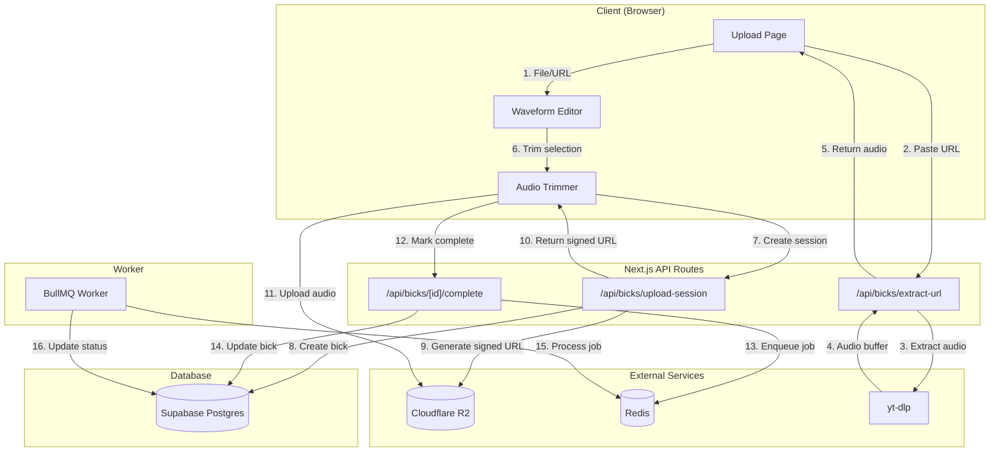

# Design Document: Upload Pipeline

## Overview

This design document describes the upload pipeline for Bickqr, enabling users to upload short audio clips (maximum 10 seconds) either by direct file upload or by extracting audio from social media video URLs. The pipeline includes client-side waveform visualization and trimming using wavesurfer.js, direct-to-R2 uploads via presigned URLs, and async job processing via BullMQ.

The architecture separates concerns between:
- Client-side: File selection, waveform visualization, audio trimming, metadata entry
- API layer: URL extraction, presigned URL generation, bick record creation
- Worker layer: Async job processing (placeholder for Spec 4)

## Architecture




### File Structure

```
src/
├── app/
│   ├── upload/
│   │   └── page.tsx                    # Upload page (client component)
│   └── api/
│       └── bicks/
│           ├── extract-url/
│           │   └── route.ts            # URL extraction endpoint
│           ├── upload-session/
│           │   └── route.ts            # Create bick + signed URL
│           └── [id]/
│               └── complete/
│                   └── route.ts        # Mark upload complete
├── components/
│   └── upload/
│       ├── UploadForm.tsx              # Main upload form
│       ├── WaveformEditor.tsx          # Waveform visualization + trimming
│       ├── UrlExtractor.tsx            # URL input + extraction UI
│       └── MetadataForm.tsx            # Title, description, tags input
├── lib/
│   ├── r2/
│   │   └── client.ts                   # R2 presigned URL generation
│   ├── queue/
│   │   ├── connection.ts               # Redis connection
│   │   ├── queues.ts                   # Queue definitions
│   │   └── jobs.ts                     # Job type definitions
│   └── audio/
│       └── extractor.ts                # yt-dlp wrapper
└── types/
    └── upload.types.ts                 # Upload-related types

worker/
├── index.ts                            # Worker entry point
├── processors/
│   └── bick-processor.ts               # Bick processing job handler
└── lib/
    └── queue.ts                        # Worker queue connection
```

## Components and Interfaces

### API Routes

#### POST /api/bicks/extract-url

Extracts audio from social media video URLs using yt-dlp.

```typescript
// src/app/api/bicks/extract-url/route.ts

interface ExtractUrlRequest {
  url: string;
}

interface ExtractUrlResponse {
  success: true;
  audioUrl: string;        // Temporary URL to extracted audio
  durationMs: number;      // Duration of extracted audio
  sourceTitle?: string;    // Original video title (for attribution)
} | {
  success: false;
  error: string;
  code: 'INVALID_URL' | 'UNSUPPORTED_PLATFORM' | 'VIDEO_UNAVAILABLE' | 'EXTRACTION_FAILED';
}

// Supported platforms regex patterns
const SUPPORTED_PLATFORMS = {
  youtube: /^(https?:\/\/)?(www\.)?(youtube\.com|youtu\.be)\/.+/,
  tiktok: /^(https?:\/\/)?(www\.|vm\.)?tiktok\.com\/.+/,
  instagram: /^(https?:\/\/)?(www\.)?instagram\.com\/(p|reel|reels)\/.+/,
  twitter: /^(https?:\/\/)?(www\.)?(twitter\.com|x\.com)\/.+\/status\/.+/,
};
```

#### POST /api/bicks/upload-session

Creates a bick record and returns a presigned R2 URL for direct upload.

```typescript
// src/app/api/bicks/upload-session/route.ts

interface UploadSessionRequest {
  title: string;
  description?: string;
  tags?: string[];
  filename: string;
  contentType: string;
  durationMs: number;
  originalDurationMs?: number;  // Pre-trim duration
  sourceUrl?: string;           // If extracted from URL
}

interface UploadSessionResponse {
  success: true;
  bickId: string;
  uploadUrl: string;           // Presigned PUT URL
  storageKey: string;          // R2 object key
  expiresAt: string;           // URL expiration timestamp
} | {
  success: false;
  error: string;
  code: 'VALIDATION_ERROR' | 'DATABASE_ERROR' | 'R2_ERROR';
  details?: Record<string, string>;
}
```

#### POST /api/bicks/[id]/complete

Marks upload as complete and enqueues processing job.

```typescript
// src/app/api/bicks/[id]/complete/route.ts

interface CompleteUploadRequest {
  storageKey: string;
  sizeBytes: number;
}

interface CompleteUploadResponse {
  success: true;
  bickId: string;
  jobId: string;
} | {
  success: false;
  error: string;
  code: 'NOT_FOUND' | 'ALREADY_COMPLETED' | 'QUEUE_ERROR';
}
```


### R2 Presigned URL Generation

```typescript
// src/lib/r2/client.ts

import { S3Client, PutObjectCommand } from '@aws-sdk/client-s3';
import { getSignedUrl } from '@aws-sdk/s3-request-presigner';

const r2Client = new S3Client({
  region: 'auto',
  endpoint: process.env.R2_ENDPOINT!,
  credentials: {
    accessKeyId: process.env.R2_ACCESS_KEY_ID!,
    secretAccessKey: process.env.R2_SECRET_ACCESS_KEY!,
  },
});

interface PresignedUrlOptions {
  key: string;
  contentType: string;
  expiresIn?: number;  // seconds, default 3600
}

export async function generatePresignedPutUrl(
  options: PresignedUrlOptions
): Promise<{ url: string; expiresAt: Date }> {
  const { key, contentType, expiresIn = 3600 } = options;
  
  const command = new PutObjectCommand({
    Bucket: process.env.R2_BUCKET_NAME!,
    Key: key,
    ContentType: contentType,
  });

  const url = await getSignedUrl(r2Client, command, { expiresIn });
  const expiresAt = new Date(Date.now() + expiresIn * 1000);

  return { url, expiresAt };
}

export function generateStorageKey(bickId: string, filename: string): string {
  const ext = filename.split('.').pop() || 'mp3';
  return `uploads/${bickId}/original.${ext}`;
}
```

### BullMQ Queue Setup

```typescript
// src/lib/queue/connection.ts

import { Redis } from 'ioredis';

export function createRedisConnection(): Redis {
  return new Redis(process.env.REDIS_URL!, {
    maxRetriesPerRequest: null,
  });
}

// src/lib/queue/queues.ts

import { Queue } from 'bullmq';
import { createRedisConnection } from './connection';

export const bickProcessingQueue = new Queue('bick-processing', {
  connection: createRedisConnection(),
  defaultJobOptions: {
    attempts: 3,
    backoff: {
      type: 'exponential',
      delay: 1000,
    },
    removeOnComplete: 100,
    removeOnFail: 1000,
  },
});

// src/lib/queue/jobs.ts

export interface BickProcessingJob {
  bickId: string;
  storageKey: string;
  originalFilename: string;
}

export async function enqueueBickProcessing(
  job: BickProcessingJob
): Promise<string> {
  const result = await bickProcessingQueue.add('process-bick', job, {
    jobId: `bick-${job.bickId}`,
  });
  return result.id!;
}
```

### Audio Extraction Service

```typescript
// src/lib/audio/extractor.ts

import { exec } from 'child_process';
import { promisify } from 'util';
import { writeFile, unlink } from 'fs/promises';
import { randomUUID } from 'crypto';
import path from 'path';

const execAsync = promisify(exec);

interface ExtractionResult {
  audioPath: string;
  durationMs: number;
  title?: string;
}

export async function extractAudioFromUrl(url: string): Promise<ExtractionResult> {
  const tempId = randomUUID();
  const outputPath = path.join('/tmp', `${tempId}.mp3`);
  const infoPath = path.join('/tmp', `${tempId}.json`);

  try {
    // Get video info first
    await execAsync(
      `yt-dlp --dump-json "${url}" > "${infoPath}"`,
      { timeout: 30000 }
    );
    
    const infoJson = await import(infoPath);
    const title = infoJson.title;
    const durationMs = Math.round((infoJson.duration || 0) * 1000);

    // Extract audio
    await execAsync(
      `yt-dlp -x --audio-format mp3 --audio-quality 0 -o "${outputPath}" "${url}"`,
      { timeout: 120000 }
    );

    return { audioPath: outputPath, durationMs, title };
  } finally {
    // Cleanup info file
    await unlink(infoPath).catch(() => {});
  }
}

export function detectPlatform(url: string): string | null {
  if (/youtube\.com|youtu\.be/.test(url)) return 'youtube';
  if (/tiktok\.com/.test(url)) return 'tiktok';
  if (/instagram\.com/.test(url)) return 'instagram';
  if (/twitter\.com|x\.com/.test(url)) return 'twitter';
  return null;
}
```


### Client Components

#### WaveformEditor Component

```typescript
// src/components/upload/WaveformEditor.tsx
'use client';

import { useRef, useEffect, useState, useCallback } from 'react';
import WaveSurfer from 'wavesurfer.js';
import RegionsPlugin from 'wavesurfer.js/dist/plugins/regions';

interface WaveformEditorProps {
  audioSource: File | string;  // File object or URL
  maxDuration: number;         // Max allowed duration in seconds (10)
  onTrimChange: (start: number, end: number) => void;
  onReady: (duration: number) => void;
}

export function WaveformEditor({
  audioSource,
  maxDuration,
  onTrimChange,
  onReady,
}: WaveformEditorProps) {
  const containerRef = useRef<HTMLDivElement>(null);
  const wavesurferRef = useRef<WaveSurfer | null>(null);
  const [isPlaying, setIsPlaying] = useState(false);
  const [duration, setDuration] = useState(0);
  const [selection, setSelection] = useState({ start: 0, end: maxDuration });

  useEffect(() => {
    if (!containerRef.current) return;

    const regions = RegionsPlugin.create();
    
    const ws = WaveSurfer.create({
      container: containerRef.current,
      waveColor: '#4F46E5',
      progressColor: '#818CF8',
      cursorColor: '#1F2937',
      height: 128,
      normalize: true,
      plugins: [regions],
    });

    wavesurferRef.current = ws;

    ws.on('ready', () => {
      const dur = ws.getDuration();
      setDuration(dur);
      onReady(dur * 1000);

      // If audio exceeds max duration, create selection region
      if (dur > maxDuration) {
        regions.addRegion({
          start: 0,
          end: maxDuration,
          color: 'rgba(79, 70, 229, 0.3)',
          drag: true,
          resize: true,
        });
      }
    });

    regions.on('region-updated', (region) => {
      const start = region.start;
      const end = Math.min(region.end, region.start + maxDuration);
      setSelection({ start, end });
      onTrimChange(start * 1000, end * 1000);
    });

    // Load audio source
    if (audioSource instanceof File) {
      ws.loadBlob(audioSource);
    } else {
      ws.load(audioSource);
    }

    return () => ws.destroy();
  }, [audioSource, maxDuration, onTrimChange, onReady]);

  const togglePlay = useCallback(() => {
    if (!wavesurferRef.current) return;
    
    if (duration > maxDuration) {
      // Play only selected region
      wavesurferRef.current.setTime(selection.start);
      wavesurferRef.current.play();
      
      // Stop at selection end
      const checkEnd = setInterval(() => {
        if (wavesurferRef.current && wavesurferRef.current.getCurrentTime() >= selection.end) {
          wavesurferRef.current.pause();
          clearInterval(checkEnd);
          setIsPlaying(false);
        }
      }, 100);
    } else {
      wavesurferRef.current.playPause();
    }
    setIsPlaying(!isPlaying);
  }, [duration, maxDuration, selection, isPlaying]);

  return (
    <div className="space-y-4">
      <div ref={containerRef} className="w-full rounded-lg bg-gray-50 p-4" />
      
      <div className="flex items-center justify-between">
        <button
          onClick={togglePlay}
          className="px-4 py-2 bg-indigo-600 text-white rounded-lg hover:bg-indigo-700"
        >
          {isPlaying ? 'Pause' : 'Play'}
        </button>
        
        <div className="text-sm text-gray-600">
          {duration > maxDuration ? (
            <span>
              Selected: {(selection.end - selection.start).toFixed(1)}s / {maxDuration}s max
            </span>
          ) : (
            <span>Duration: {duration.toFixed(1)}s</span>
          )}
        </div>
      </div>
      
      {duration > maxDuration && (
        <p className="text-sm text-amber-600">
          Audio exceeds {maxDuration} seconds. Drag the selection to choose which portion to upload.
        </p>
      )}
    </div>
  );
}
```

#### Audio Trimming Utility

```typescript
// src/lib/audio/trimmer.ts (client-side)

export async function trimAudio(
  audioFile: File | Blob,
  startMs: number,
  endMs: number
): Promise<Blob> {
  const audioContext = new AudioContext();
  const arrayBuffer = await audioFile.arrayBuffer();
  const audioBuffer = await audioContext.decodeAudioData(arrayBuffer);

  const startSample = Math.floor((startMs / 1000) * audioBuffer.sampleRate);
  const endSample = Math.floor((endMs / 1000) * audioBuffer.sampleRate);
  const length = endSample - startSample;

  const trimmedBuffer = audioContext.createBuffer(
    audioBuffer.numberOfChannels,
    length,
    audioBuffer.sampleRate
  );

  for (let channel = 0; channel < audioBuffer.numberOfChannels; channel++) {
    const sourceData = audioBuffer.getChannelData(channel);
    const targetData = trimmedBuffer.getChannelData(channel);
    for (let i = 0; i < length; i++) {
      targetData[i] = sourceData[startSample + i];
    }
  }

  // Encode to WAV
  return encodeWav(trimmedBuffer);
}

function encodeWav(audioBuffer: AudioBuffer): Blob {
  const numChannels = audioBuffer.numberOfChannels;
  const sampleRate = audioBuffer.sampleRate;
  const format = 1; // PCM
  const bitDepth = 16;

  const bytesPerSample = bitDepth / 8;
  const blockAlign = numChannels * bytesPerSample;
  const byteRate = sampleRate * blockAlign;
  const dataSize = audioBuffer.length * blockAlign;
  const buffer = new ArrayBuffer(44 + dataSize);
  const view = new DataView(buffer);

  // WAV header
  writeString(view, 0, 'RIFF');
  view.setUint32(4, 36 + dataSize, true);
  writeString(view, 8, 'WAVE');
  writeString(view, 12, 'fmt ');
  view.setUint32(16, 16, true);
  view.setUint16(20, format, true);
  view.setUint16(22, numChannels, true);
  view.setUint32(24, sampleRate, true);
  view.setUint32(28, byteRate, true);
  view.setUint16(32, blockAlign, true);
  view.setUint16(34, bitDepth, true);
  writeString(view, 36, 'data');
  view.setUint32(40, dataSize, true);

  // Audio data
  const offset = 44;
  for (let i = 0; i < audioBuffer.length; i++) {
    for (let channel = 0; channel < numChannels; channel++) {
      const sample = audioBuffer.getChannelData(channel)[i];
      const intSample = Math.max(-1, Math.min(1, sample)) * 0x7FFF;
      view.setInt16(offset + (i * blockAlign) + (channel * bytesPerSample), intSample, true);
    }
  }

  return new Blob([buffer], { type: 'audio/wav' });
}

function writeString(view: DataView, offset: number, str: string) {
  for (let i = 0; i < str.length; i++) {
    view.setUint8(offset + i, str.charCodeAt(i));
  }
}
```


#### Upload Form Component

```typescript
// src/components/upload/UploadForm.tsx
'use client';

import { useState, useCallback } from 'react';
import { WaveformEditor } from './WaveformEditor';
import { UrlExtractor } from './UrlExtractor';
import { MetadataForm } from './MetadataForm';
import { trimAudio } from '@/lib/audio/trimmer';

const MAX_DURATION_MS = 10000;
const MAX_FILE_SIZE = 10 * 1024 * 1024; // 10MB
const ALLOWED_TYPES = ['audio/mpeg', 'audio/wav', 'audio/ogg', 'audio/mp4'];

type UploadStep = 'source' | 'trim' | 'metadata' | 'uploading' | 'complete';

export function UploadForm() {
  const [step, setStep] = useState<UploadStep>('source');
  const [audioSource, setAudioSource] = useState<File | string | null>(null);
  const [sourceUrl, setSourceUrl] = useState<string | null>(null);
  const [originalDurationMs, setOriginalDurationMs] = useState(0);
  const [trimRange, setTrimRange] = useState({ start: 0, end: MAX_DURATION_MS });
  const [error, setError] = useState<string | null>(null);
  const [uploadProgress, setUploadProgress] = useState(0);

  const handleFileSelect = useCallback((file: File) => {
    setError(null);
    
    if (!ALLOWED_TYPES.includes(file.type)) {
      setError('Unsupported file type. Please upload MP3, WAV, OGG, or M4A.');
      return;
    }
    
    if (file.size > MAX_FILE_SIZE) {
      setError('File too large. Maximum size is 10MB.');
      return;
    }

    setAudioSource(file);
    setSourceUrl(null);
    setStep('trim');
  }, []);

  const handleUrlExtracted = useCallback((audioUrl: string, url: string, durationMs: number) => {
    setAudioSource(audioUrl);
    setSourceUrl(url);
    setOriginalDurationMs(durationMs);
    setStep('trim');
  }, []);

  const handleTrimChange = useCallback((start: number, end: number) => {
    setTrimRange({ start, end });
  }, []);

  const handleAudioReady = useCallback((durationMs: number) => {
    setOriginalDurationMs(durationMs);
    if (durationMs <= MAX_DURATION_MS) {
      setTrimRange({ start: 0, end: durationMs });
    }
  }, []);

  const handleMetadataSubmit = useCallback(async (metadata: {
    title: string;
    description?: string;
    tags?: string[];
  }) => {
    if (!audioSource) return;
    
    setStep('uploading');
    setError(null);

    try {
      // 1. Trim audio if needed
      let audioBlob: Blob;
      if (audioSource instanceof File) {
        if (originalDurationMs > MAX_DURATION_MS) {
          audioBlob = await trimAudio(audioSource, trimRange.start, trimRange.end);
        } else {
          audioBlob = audioSource;
        }
      } else {
        // Fetch and trim URL audio
        const response = await fetch(audioSource);
        const blob = await response.blob();
        if (originalDurationMs > MAX_DURATION_MS) {
          audioBlob = await trimAudio(blob, trimRange.start, trimRange.end);
        } else {
          audioBlob = blob;
        }
      }

      // 2. Create upload session
      const sessionRes = await fetch('/api/bicks/upload-session', {
        method: 'POST',
        headers: { 'Content-Type': 'application/json' },
        body: JSON.stringify({
          title: metadata.title,
          description: metadata.description,
          tags: metadata.tags,
          filename: audioSource instanceof File ? audioSource.name : 'extracted.mp3',
          contentType: audioBlob.type,
          durationMs: trimRange.end - trimRange.start,
          originalDurationMs,
          sourceUrl,
        }),
      });

      const session = await sessionRes.json();
      if (!session.success) {
        throw new Error(session.error);
      }

      // 3. Upload to R2
      const uploadRes = await fetch(session.uploadUrl, {
        method: 'PUT',
        body: audioBlob,
        headers: { 'Content-Type': audioBlob.type },
      });

      if (!uploadRes.ok) {
        throw new Error('Failed to upload to storage');
      }

      // 4. Mark complete
      const completeRes = await fetch(`/api/bicks/${session.bickId}/complete`, {
        method: 'POST',
        headers: { 'Content-Type': 'application/json' },
        body: JSON.stringify({
          storageKey: session.storageKey,
          sizeBytes: audioBlob.size,
        }),
      });

      const complete = await completeRes.json();
      if (!complete.success) {
        throw new Error(complete.error);
      }

      setStep('complete');
    } catch (err) {
      setError(err instanceof Error ? err.message : 'Upload failed');
      setStep('metadata');
    }
  }, [audioSource, originalDurationMs, trimRange, sourceUrl]);

  return (
    <div className="max-w-2xl mx-auto space-y-6">
      {error && (
        <div className="p-4 bg-red-50 text-red-700 rounded-lg">{error}</div>
      )}

      {step === 'source' && (
        <div className="space-y-6">
          <FileDropzone onFileSelect={handleFileSelect} />
          <div className="text-center text-gray-500">or</div>
          <UrlExtractor onExtracted={handleUrlExtracted} />
        </div>
      )}

      {step === 'trim' && audioSource && (
        <div className="space-y-6">
          <WaveformEditor
            audioSource={audioSource}
            maxDuration={MAX_DURATION_MS / 1000}
            onTrimChange={handleTrimChange}
            onReady={handleAudioReady}
          />
          <button
            onClick={() => setStep('metadata')}
            className="w-full py-3 bg-indigo-600 text-white rounded-lg hover:bg-indigo-700"
          >
            Continue
          </button>
        </div>
      )}

      {step === 'metadata' && (
        <MetadataForm onSubmit={handleMetadataSubmit} />
      )}

      {step === 'uploading' && (
        <div className="text-center py-12">
          <div className="animate-spin w-12 h-12 border-4 border-indigo-600 border-t-transparent rounded-full mx-auto" />
          <p className="mt-4 text-gray-600">Uploading your bick...</p>
        </div>
      )}

      {step === 'complete' && (
        <div className="text-center py-12">
          <div className="w-16 h-16 bg-green-100 rounded-full flex items-center justify-center mx-auto">
            <svg className="w-8 h-8 text-green-600" fill="none" viewBox="0 0 24 24" stroke="currentColor">
              <path strokeLinecap="round" strokeLinejoin="round" strokeWidth={2} d="M5 13l4 4L19 7" />
            </svg>
          </div>
          <h2 className="mt-4 text-xl font-semibold">Upload Complete!</h2>
          <p className="mt-2 text-gray-600">Your bick is being processed and will be live shortly.</p>
        </div>
      )}
    </div>
  );
}
```


### Worker Implementation

```typescript
// worker/index.ts

import { Worker } from 'bullmq';
import { createRedisConnection } from './lib/queue';
import { processBick } from './processors/bick-processor';

const worker = new Worker(
  'bick-processing',
  async (job) => {
    console.log(`Processing job ${job.id}: ${job.name}`);
    return processBick(job.data);
  },
  {
    connection: createRedisConnection(),
    concurrency: 5,
  }
);

worker.on('completed', (job) => {
  console.log(`Job ${job.id} completed`);
});

worker.on('failed', (job, err) => {
  console.error(`Job ${job?.id} failed:`, err);
});

console.log('Worker started');

// worker/processors/bick-processor.ts

import { createAdminClient } from '@/lib/supabase/server';
import type { BickProcessingJob } from '@/lib/queue/jobs';

export async function processBick(job: BickProcessingJob): Promise<void> {
  const supabase = createAdminClient();

  // Placeholder: In Spec 4, this will:
  // 1. Download audio from R2
  // 2. Generate waveform JSON
  // 3. Generate OG image
  // 4. Generate teaser MP4
  // 5. Upload generated assets to R2
  // 6. Create bick_assets records

  // For now, just mark as live
  const { error } = await supabase
    .from('bicks')
    .update({ status: 'live' })
    .eq('id', job.bickId);

  if (error) {
    throw new Error(`Failed to update bick status: ${error.message}`);
  }
}
```

## Data Models

### Database Schema Updates

```sql
-- supabase/migrations/0002_upload_pipeline.sql

-- Add source_url for URL extraction attribution
ALTER TABLE bicks ADD COLUMN IF NOT EXISTS source_url TEXT;

-- Add original_duration_ms for tracking pre-trim duration
ALTER TABLE bicks ADD COLUMN IF NOT EXISTS original_duration_ms INTEGER;

-- Make owner_id nullable for anonymous uploads
ALTER TABLE bicks ALTER COLUMN owner_id DROP NOT NULL;

-- Update RLS policy for anonymous inserts
DROP POLICY IF EXISTS "bicks_auth_insert" ON bicks;
CREATE POLICY "bicks_insert" ON bicks
    FOR INSERT WITH CHECK (true);

-- Index for source_url lookups (optional, for attribution queries)
CREATE INDEX IF NOT EXISTS bicks_source_url_idx ON bicks (source_url) WHERE source_url IS NOT NULL;
```

### TypeScript Type Updates

```typescript
// src/types/database.types.ts (additions)

export interface BickInsert {
  owner_id?: string | null;  // Now optional
  slug: string;
  title: string;
  description?: string | null;
  status?: BickStatus;
  duration_ms?: number | null;
  original_duration_ms?: number | null;  // New field
  original_filename?: string | null;
  source_url?: string | null;  // New field
}

export interface Bick {
  // ... existing fields ...
  source_url: string | null;
  original_duration_ms: number | null;
}
```

### Upload Types

```typescript
// src/types/upload.types.ts

export interface UploadSession {
  bickId: string;
  uploadUrl: string;
  storageKey: string;
  expiresAt: string;
}

export interface ExtractedAudio {
  audioUrl: string;
  durationMs: number;
  sourceTitle?: string;
  platform: 'youtube' | 'tiktok' | 'instagram' | 'twitter';
}

export interface UploadMetadata {
  title: string;
  description?: string;
  tags?: string[];
}

export type UploadError = 
  | { code: 'FILE_TOO_LARGE'; maxSize: number }
  | { code: 'UNSUPPORTED_TYPE'; allowedTypes: string[] }
  | { code: 'INVALID_URL'; message: string }
  | { code: 'UNSUPPORTED_PLATFORM'; supportedPlatforms: string[] }
  | { code: 'EXTRACTION_FAILED'; message: string }
  | { code: 'UPLOAD_FAILED'; message: string };
```


## Correctness Properties

*A property is a characteristic or behavior that should hold true across all valid executions of a system—essentially, a formal statement about what the system should do. Properties serve as the bridge between human-readable specifications and machine-verifiable correctness guarantees.*

Based on the prework analysis, the following properties have been identified for property-based testing:

### Property 1: MIME Type Validation

*For any* file with a MIME type, the validation function SHALL accept the file if and only if the MIME type is one of: audio/mpeg, audio/wav, audio/ogg, audio/mp4.

**Validates: Requirements 1.1, 1.3**

### Property 2: File Size Validation

*For any* file size in bytes, the validation function SHALL reject the file if and only if the size exceeds 10,485,760 bytes (10MB).

**Validates: Requirements 1.2**

### Property 3: URL Platform Detection

*For any* URL string, the platform detection function SHALL return a supported platform name if and only if the URL matches the pattern for YouTube, TikTok, Instagram, or Twitter/X.

**Validates: Requirements 2.1, 2.2**

### Property 4: Duration Enforcement

*For any* audio duration in milliseconds, the upload pipeline SHALL require trimming if and only if the duration exceeds 10,000ms (10 seconds).

**Validates: Requirements 3.1, 3.4**

### Property 5: Audio Trimming Accuracy

*For any* audio buffer and valid trim range (start, end) where end - start <= 10000ms, the trimmed output SHALL have a duration equal to (end - start) within a tolerance of 100ms.

**Validates: Requirements 3.5**

### Property 6: Title Validation

*For any* string, the title validation function SHALL accept the string if and only if its length is between 1 and 100 characters inclusive.

**Validates: Requirements 5.1**

### Property 7: Description Validation

*For any* string, the description validation function SHALL accept the string if and only if its length is at most 500 characters.

**Validates: Requirements 5.2**

### Property 8: Tag Format Validation

*For any* string, the tag validation function SHALL accept the string if and only if it contains only alphanumeric characters and hyphens.

**Validates: Requirements 5.4**

### Property 9: Tag Count Validation

*For any* array of tags, the validation function SHALL reject the array if and only if it contains more than 10 elements.

**Validates: Requirements 5.5**

### Property 10: Slug Generation

*For any* title string, the generated slug SHALL contain only lowercase letters, numbers, and hyphens, and SHALL not be empty.

**Validates: Requirements 7.3**

### Property 11: Bick Creation Status

*For any* bick created through the upload session endpoint, the initial status SHALL be 'processing'.

**Validates: Requirements 7.1**

### Property 12: Owner Association

*For any* upload session request, the created bick SHALL have owner_id set to the authenticated user's ID if authenticated, or null if not authenticated.

**Validates: Requirements 7.4, 7.5**

### Property 13: Source URL Persistence

*For any* upload session request with a source_url field, the created bick record SHALL have source_url set to that value.

**Validates: Requirements 7.6**

### Property 14: Job Payload Structure

*For any* processing job enqueued after upload completion, the job payload SHALL contain bickId and storageKey fields.

**Validates: Requirements 8.2**

### Property 15: API Validation Errors

*For any* API request with invalid data, the response SHALL have status 400 and include a JSON body with error details.

**Validates: Requirements 9.4**


## Error Handling

### Client-Side Errors

| Error Type | Cause | User Message |
|------------|-------|--------------|
| FILE_TOO_LARGE | File > 10MB | "File too large. Maximum size is 10MB." |
| UNSUPPORTED_TYPE | Invalid MIME type | "Unsupported file type. Please upload MP3, WAV, OGG, or M4A." |
| INVALID_URL | Malformed URL | "Please enter a valid URL." |
| UNSUPPORTED_PLATFORM | URL not from supported platform | "Unsupported platform. We support YouTube, TikTok, Instagram, and Twitter/X." |
| EXTRACTION_FAILED | yt-dlp error | "Could not extract audio. The video may be unavailable or private." |
| UPLOAD_FAILED | R2 upload error | "Upload failed. Please try again." |
| TRIM_ERROR | Audio processing error | "Could not process audio. Please try a different file." |

### API Error Responses

```typescript
// Standard error response format
interface ApiError {
  success: false;
  error: string;
  code: string;
  details?: Record<string, string>;
}

// Validation error example
{
  success: false,
  error: "Validation failed",
  code: "VALIDATION_ERROR",
  details: {
    title: "Title must be between 1 and 100 characters",
    tags: "Maximum 10 tags allowed"
  }
}
```

### Error Recovery

1. **File validation errors**: User can select a different file
2. **URL extraction errors**: User can try a different URL or upload directly
3. **Upload errors**: Retry button preserves metadata
4. **Network errors**: Automatic retry with exponential backoff (3 attempts)

### Worker Error Handling

```typescript
// Job retry configuration
{
  attempts: 3,
  backoff: {
    type: 'exponential',
    delay: 1000,  // 1s, 2s, 4s
  },
}

// On final failure, update bick status
async function handleJobFailure(job: Job, error: Error) {
  await supabase
    .from('bicks')
    .update({ status: 'failed' })
    .eq('id', job.data.bickId);
}
```

## Testing Strategy

### Dual Testing Approach

This feature requires both unit tests and property-based tests:

- **Unit tests**: Verify specific examples, edge cases, API responses, and component rendering
- **Property tests**: Verify validation logic, slug generation, and data transformations

### Property-Based Testing Configuration

- **Library**: fast-check
- **Minimum iterations**: 100 per property test
- **Tag format**: `Feature: upload-pipeline, Property N: {property_text}`

### Test Categories

#### Validation Tests (Property-Based)

```typescript
// Feature: upload-pipeline, Property 1: MIME Type Validation
import fc from 'fast-check';
import { isValidMimeType } from '@/lib/upload/validation';

describe('MIME Type Validation', () => {
  const validTypes = ['audio/mpeg', 'audio/wav', 'audio/ogg', 'audio/mp4'];

  it('accepts valid MIME types', () => {
    fc.assert(
      fc.property(
        fc.constantFrom(...validTypes),
        (mimeType) => isValidMimeType(mimeType) === true
      ),
      { numRuns: 100 }
    );
  });

  it('rejects invalid MIME types', () => {
    fc.assert(
      fc.property(
        fc.string().filter(s => !validTypes.includes(s)),
        (mimeType) => isValidMimeType(mimeType) === false
      ),
      { numRuns: 100 }
    );
  });
});

// Feature: upload-pipeline, Property 10: Slug Generation
describe('Slug Generation', () => {
  it('produces URL-safe slugs for any title', () => {
    fc.assert(
      fc.property(
        fc.string({ minLength: 1, maxLength: 100 }),
        (title) => {
          const slug = generateSlug(title);
          return /^[a-z0-9-]+$/.test(slug) && slug.length > 0;
        }
      ),
      { numRuns: 100 }
    );
  });
});
```

#### API Route Tests (Unit)

```typescript
describe('POST /api/bicks/upload-session', () => {
  it('creates bick with processing status');
  it('returns signed URL with valid expiration');
  it('validates title length');
  it('validates tag count');
  it('stores source_url when provided');
  it('sets owner_id to null for anonymous users');
});

describe('POST /api/bicks/[id]/complete', () => {
  it('enqueues processing job');
  it('returns 404 for non-existent bick');
  it('returns error for already completed bick');
});
```

#### Integration Tests (Unit)

```typescript
describe('Upload Flow Integration', () => {
  it('completes full upload flow with file');
  it('completes full upload flow with URL extraction');
  it('handles R2 upload failure gracefully');
  it('preserves metadata on retry');
});
```

### Test Environment Setup

```typescript
// tests/setup.ts
import { beforeEach, afterEach } from 'vitest';
import { createAdminClient } from '@/lib/supabase/server';

beforeEach(async () => {
  // Clean test data
  const supabase = createAdminClient();
  await supabase.from('bick_assets').delete().neq('id', '');
  await supabase.from('bicks').delete().neq('id', '');
});

// Mock R2 client for tests
vi.mock('@/lib/r2/client', () => ({
  generatePresignedPutUrl: vi.fn().mockResolvedValue({
    url: 'https://mock-r2.example.com/upload',
    expiresAt: new Date(Date.now() + 3600000),
  }),
}));

// Mock Redis for queue tests
vi.mock('ioredis', () => ({
  default: vi.fn().mockImplementation(() => ({
    on: vi.fn(),
    disconnect: vi.fn(),
  })),
}));
```
