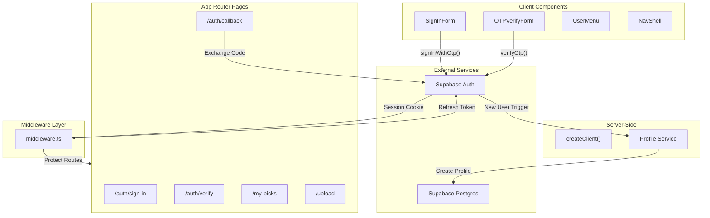

# Design Document: User Authentication

## Overview

This design implements email OTP (One-Time Password) authentication for Bickqr using Supabase Auth. Users authenticate by entering their email address and receiving a 6-digit code (or magic link) via email. The system automatically creates accounts for new users and links uploaded bicks to authenticated users via the `owner_id` field.

The implementation leverages Supabase's built-in OTP functionality with Next.js App Router, using server-side session management via cookies and middleware for automatic token refresh.

## Architecture



## Components and Interfaces

### Auth Components

#### SignInForm
Client component for email input and OTP request.

```typescript
interface SignInFormProps {
  redirectTo?: string;
}

interface SignInFormState {
  email: string;
  isLoading: boolean;
  error: string | null;
  emailSent: boolean;
}
```

#### OTPVerifyForm
Client component for OTP code entry and verification.

```typescript
interface OTPVerifyFormProps {
  email: string;
  redirectTo?: string;
}

interface OTPVerifyFormState {
  code: string;
  isLoading: boolean;
  error: string | null;
}
```

#### UserMenu
Client component displaying authenticated user options.

```typescript
interface UserMenuProps {
  user: {
    email: string;
    displayName?: string;
    avatarUrl?: string;
  };
}
```

### Auth Service Functions

```typescript
// src/lib/auth/actions.ts

/**
 * Send OTP code to email address
 * Creates new user if email doesn't exist
 */
async function sendOTP(email: string): Promise<{ success: boolean; error?: string }>;

/**
 * Verify OTP code and establish session
 */
async function verifyOTP(
  email: string, 
  code: string
): Promise<{ success: boolean; error?: string }>;

/**
 * Sign out current user and clear session
 */
async function signOut(): Promise<void>;

/**
 * Get current authenticated user (server-side)
 */
async function getUser(): Promise<User | null>;

/**
 * Get current user's profile with username
 */
async function getUserProfile(): Promise<Profile | null>;
```

### Profile Service Functions

```typescript
// src/lib/auth/profile.ts

/**
 * Create profile for new user with generated username
 */
async function createProfile(userId: string, email: string): Promise<Profile>;

/**
 * Generate unique username from email prefix
 */
function generateUsername(email: string): string;

/**
 * Ensure username is unique, append suffix if needed
 */
async function ensureUniqueUsername(baseUsername: string): Promise<string>;
```

### Route Protection

```typescript
// src/lib/auth/protect.ts

/**
 * Check if user is authenticated, redirect to sign-in if not
 * Preserves original URL for post-login redirect
 */
async function requireAuth(redirectTo?: string): Promise<User>;
```

## Data Models

### Auth Session (Supabase Managed)

Supabase Auth manages sessions via HTTP-only cookies. The session contains:

```typescript
interface Session {
  access_token: string;
  refresh_token: string;
  expires_at: number;
  user: {
    id: string;
    email: string;
    email_confirmed_at: string;
    created_at: string;
  };
}
```

### Profile (Existing Table)

The existing `profiles` table is used:

```typescript
interface Profile {
  id: string;           // UUID, FK to auth.users
  username: string;     // Unique, generated from email
  display_name: string | null;
  avatar_url: string | null;
  created_at: string;
  updated_at: string;
}
```

### Bick Owner Association

The existing `bicks.owner_id` column links bicks to profiles:

```typescript
interface Bick {
  // ... existing fields
  owner_id: string | null;  // FK to profiles.id
}
```

## Correctness Properties

*A property is a characteristic or behavior that should hold true across all valid executions of a system—essentially, a formal statement about what the system should do. Properties serve as the bridge between human-readable specifications and machine-verifiable correctness guarantees.*


### Property 1: Valid OTP Verification Creates Session

*For any* valid email and OTP code pair within the expiration window, calling verifyOtp SHALL return a valid session with the user's ID and email.

**Validates: Requirements 1.2**

### Property 2: Invalid OTP Returns Error

*For any* invalid or expired OTP code, calling verifyOtp SHALL return an error and no session SHALL be created.

**Validates: Requirements 1.3**

### Property 3: New User Profile Creation

*For any* new user authenticating for the first time, a Profile record SHALL be created with:
- `id` matching the auth.users ID
- `username` derived from the email prefix, unique across all profiles
- `display_name` set to the email prefix

**Validates: Requirements 1.5, 1.6, 10.1, 10.2, 10.3, 10.4**

### Property 4: Valid Callback Exchanges Code for Session

*For any* valid token_hash received at the callback route, the system SHALL exchange it for a session and redirect to the destination specified by the `next` parameter.

**Validates: Requirements 2.2, 9.2, 9.4**

### Property 5: Invalid Callback Redirects with Error

*For any* invalid or expired token_hash received at the callback route, the system SHALL redirect to the sign-in page with an error message.

**Validates: Requirements 2.3, 9.3**

### Property 6: Sign Out Clears Session

*For any* authenticated user, calling signOut SHALL invalidate the session and clear all authentication cookies.

**Validates: Requirements 3.1, 3.2**

### Property 7: Session Persistence

*For any* valid session, calling getUser across multiple requests SHALL return the same user until the session expires or is invalidated.

**Validates: Requirements 4.1**

### Property 8: Protected Route Redirect

*For any* unauthenticated request to a protected route, the system SHALL redirect to the sign-in page with the original URL preserved in the `next` query parameter.

**Validates: Requirements 5.1, 5.2, 5.3, 8.2**

### Property 9: Authenticated Access to Protected Routes

*For any* authenticated user accessing a protected route, the system SHALL allow access without redirect.

**Validates: Requirements 5.4**

### Property 10: My Bicks Query Isolation

*For any* authenticated user, the My Bicks dashboard query SHALL return only bicks where `owner_id` matches the user's profile ID, including all statuses (processing, live, failed, removed).

**Validates: Requirements 7.1, 7.2**

### Property 11: Upload Owner Association

*For any* bick uploaded by an authenticated user, the `owner_id` field SHALL be set to the user's profile ID.

**Validates: Requirements 8.1**

### Property 12: Username Uniqueness

*For any* generated username, if a profile with that username already exists, the system SHALL append a random suffix until a unique username is found.

**Validates: Requirements 10.3**

## Error Handling

### OTP Errors

| Error Condition | User Message | Action |
|-----------------|--------------|--------|
| Invalid email format | "Please enter a valid email address" | Show inline validation error |
| Rate limited (60s) | "Please wait before requesting another code" | Disable button with countdown |
| Invalid OTP code | "Invalid code. Please try again." | Clear input, allow retry |
| Expired OTP code | "Code expired. Request a new one." | Show resend option |
| Network error | "Connection error. Please try again." | Allow retry |

### Session Errors

| Error Condition | Action |
|-----------------|--------|
| Session expired | Clear cookies, redirect to sign-in |
| Refresh token invalid | Clear cookies, redirect to sign-in |
| Profile not found | Create profile on-demand |

### Callback Errors

| Error Condition | Redirect |
|-----------------|----------|
| Missing token_hash | `/auth/sign-in?error=missing_token` |
| Invalid token_hash | `/auth/sign-in?error=invalid_token` |
| Expired token_hash | `/auth/sign-in?error=expired_token` |
| Exchange failed | `/auth/sign-in?error=auth_failed` |

## Testing Strategy

### Unit Tests

Unit tests focus on specific examples and edge cases:

1. **Username Generation**
   - Email prefix extraction
   - Special character handling
   - Suffix generation for duplicates

2. **Route Protection**
   - Redirect URL construction
   - Query parameter preservation

3. **Component Rendering**
   - SignInForm states (initial, loading, sent)
   - OTPVerifyForm states (initial, loading, error)
   - UserMenu authenticated/unauthenticated states

### Property-Based Tests

Property tests use a property-based testing library (e.g., fast-check) with minimum 100 iterations per test.

1. **Property 3: Username Generation**
   - Generate random email addresses
   - Verify username is valid (alphanumeric, lowercase)
   - Verify uniqueness constraint handling

2. **Property 8: Protected Route Redirect**
   - Generate random protected route paths
   - Verify redirect includes correct `next` parameter

3. **Property 10: My Bicks Query Isolation**
   - Generate random user IDs and bick sets
   - Verify query returns only matching owner_id bicks

4. **Property 12: Username Uniqueness**
   - Generate scenarios with existing usernames
   - Verify suffix appended until unique

### Integration Tests

1. **Auth Flow**
   - Sign-in form submission
   - OTP verification
   - Session establishment
   - Sign-out

2. **Protected Routes**
   - Unauthenticated access redirect
   - Authenticated access allowed
   - Post-login redirect to original URL

3. **My Bicks Dashboard**
   - Bick list rendering
   - Pagination
   - Empty state

## File Structure

```
src/
├── app/
│   ├── auth/
│   │   ├── sign-in/
│   │   │   └── page.tsx          # Sign-in page
│   │   ├── verify/
│   │   │   └── page.tsx          # OTP verification page
│   │   └── callback/
│   │       └── route.ts          # Magic link callback handler
│   ├── my-bicks/
│   │   └── page.tsx              # My Bicks dashboard
│   └── upload/
│       └── page.tsx              # Updated with auth protection
├── components/
│   ├── auth/
│   │   ├── SignInForm.tsx        # Email input form
│   │   ├── OTPVerifyForm.tsx     # OTP code input form
│   │   └── UserMenu.tsx          # Authenticated user dropdown
│   └── layout/
│       └── NavShell.tsx          # Updated with auth state
├── lib/
│   └── auth/
│       ├── actions.ts            # Server actions for auth
│       ├── profile.ts            # Profile creation service
│       └── protect.ts            # Route protection utility
└── middleware.ts                 # Session refresh middleware
```

## Middleware Configuration

```typescript
// middleware.ts
import { createServerClient } from '@supabase/ssr';
import { NextResponse, type NextRequest } from 'next/server';

const protectedRoutes = ['/upload', '/my-bicks'];

export async function middleware(request: NextRequest) {
  // 1. Refresh session token if needed
  // 2. Check if route is protected
  // 3. Redirect unauthenticated users to sign-in
  // 4. Preserve original URL in `next` parameter
}

export const config = {
  matcher: [
    '/((?!_next/static|_next/image|favicon.ico|.*\\.(?:svg|png|jpg|jpeg|gif|webp)$).*)',
  ],
};
```

## Supabase Configuration

### Email Template (OTP)

Configure in Supabase Dashboard > Authentication > Email Templates > Magic Link:

```html
<h2>Sign in to Bickqr</h2>
<p>Your verification code is: <strong>{{ .Token }}</strong></p>
<p>Or click this link to sign in:</p>
<p><a href="{{ .SiteURL }}/auth/callback?token_hash={{ .TokenHash }}&type=email&next={{ .RedirectTo }}">Sign in to Bickqr</a></p>
<p>This code expires in 1 hour.</p>
```

### URL Configuration

- Site URL: `https://bickqr.com` (production) or `http://localhost:3000` (development)
- Redirect URLs: `https://bickqr.com/auth/callback`, `http://localhost:3000/auth/callback`
